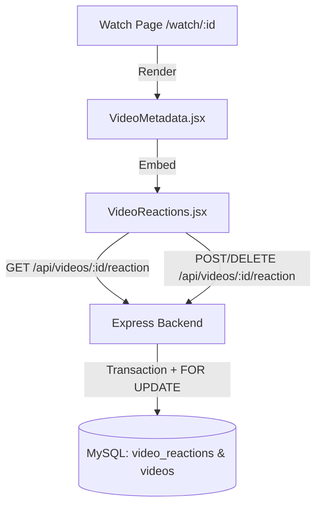

# Learn To Build a Real Time Website Like YouTube

> **A full-stack, enterprise-grade, real-time video streaming, video calling, and community platform built with React, Node.js, Express, Socket.IO, WebRTC, and MySQL.**

[](#project-status)
[](#license)
[](#backend)
[](#frontend)
[](#database)

---

## Project Status

- **Current Phase**: **Phase 33 — GitHub Finalization & Submission**
- **Deployment Status**: **Ready for deployment** (Pre-deployment audit passed with 100% test coverage)
- **Live Demo**: `[Will be added after Phase 34]`
- **Repository**: [https://github.com/aditi04122007/youtube-realtime-platform](https://github.com/aditi04122007/youtube-realtime-platform)

---

## Project Overview

**Learn To Build a Real Time Website Like YouTube** is a comprehensive, production-ready web application replicating and expanding upon core YouTube features with added real-time peer-to-peer communication, monetization, and community moderation. Developed methodically across 32 engineering phases, this platform integrates:

- **High-Performance Video Streaming**: RFC 7233 chunked HTTP Range streaming (HTTP 206 Partial Content), custom HTML5 player with theater mode, custom playback speeds, scrubbable progress bar, and keyboard shortcuts.
- **Engagement & Community**: Threaded comments with nested replies, real-time multi-language translation across 15+ languages, single-reaction like/dislike system, channel subscriptions, and watch history with resume playback.
- **Monetization & Tiered Access**: Tiered subscription plans (Free, Bronze, Silver, Gold), official Razorpay Test Mode checkout flow with HMAC-SHA256 signature verification, zero-byte premium stream gating, and controlled video downloads with monthly quotas.
- **Real-Time Video Communication**: WebRTC-powered 1:1 video calls and multi-user conference rooms (up to 6 participants in full-mesh P2P topology), host moderation (remote mute, camera disabling, ejection, ban), in-call text chat, secure in-call file sharing, screen sharing with resolution preservation, audio device switching, and automated 25-second connection recovery with ICE restarts.
- **Platform Administration & Security**: Centralized admin dashboard with live platform metrics, content moderation queue, report resolution, user suspension/role management, emergency room termination, device-based session invalidation, two-factor OTP authentication, and account lockout protection.

---

## Technology Stack

### Frontend
- **React (v18.3+)** - Component-based declarative user interface
- **Vite (v6.0+)** - High-performance next-generation frontend build tooling
- **Tailwind CSS (v3.4+)** - Utility-first CSS framework with dynamic dark/light theme support
- **React Router DOM (v6.28+)** - Client-side routing with granular authentication & role guards
- **Lucide React** - Modern, accessible SVG icon library
- **Axios** - Promise-based HTTP client with credentials and interceptors
- **Socket.IO Client (v4.8+)** - Real-time WebSocket connection for notifications and call signaling
- **WebRTC (Browser Native API)** - Pure peer-to-peer audio, video, and screen sharing pipelines

### Backend
- **Node.js (v18+ / v20+ / v22+)** - Scalable asynchronous event-driven JavaScript runtime
- **Express.js (v4.21+)** - Minimalist, robust REST API server framework
- **Socket.IO (v4.8+)** - Low-latency bidirectional WebSocket communication engine
- **MySQL2 / Promise (v3.24+)** - High-throughput connection pooling with ACID transaction support
- **JWT (jsonwebtoken v9.0+)** - Stateless token-based authentication with database-backed device revocation
- **Bcryptjs (v3.0+)** - Salted password and OTP hash encryption (cost factor 12)
- **Multer (v2.3+)** - Secure multipart/form-data upload handling with MIME validation and disk storage
- **Razorpay SDK (v2.9+)** - Official payment gateway integration in strict Test Mode
- **Helmet (v8.0+)** - HTTP security header hardening with Cross-Origin Resource Policy
- **CORS** - Strict Cross-Origin Resource Sharing with credentials whitelist
- **express-rate-limit (v7.5+)** - Granular per-route rate limiting for brute-force and DDoS prevention
- **Morgan** - Structured HTTP request logger

### Database
- **MySQL 8.0+**
- **Storage Engine**: InnoDB (ACID transactional guarantees, cascading foreign keys, row-level locking)
- **Character Set**: `utf8mb4` / Collation: `utf8mb4_unicode_ci`
- **Database Name**: `video_platform`
- **Schema**: 41 relational tables spanning 7 core functional domains (Identity, Content, Social, Subscriptions, Payments, Calling, Moderation)
- **Search Engine**: MySQL `FULLTEXT` index on video titles and descriptions with logarithmic popularity scoring
- **Connection Pool**: 10 concurrent connections with automated keep-alive and error recovery

---

---

## Folder Structure

```text
youtube-realtime-platform/
│
├── frontend/                    # Client Application (React 18 + Vite + Tailwind)
│   ├── src/
│   │   ├── components/
│   │   │   ├── admin/           # Platform metrics, moderation, charts
│   │   │   ├── call/            # WebRTC video mesh, device settings, in-call chat & files
│   │   │   ├── comments/        # Comments, replies, translation widget
│   │   │   ├── common/          # Button, Modal, Loading, ErrorMessage, EmptyState, Card
│   │   │   ├── navigation/      # Navbar, Sidebar, MobileNav
│   │   │   ├── player/          # Custom HTML5 video player & controls
│   │   │   ├── playlists/       # Playlist management & reordering
│   │   │   └── video/           # VideoCard, VideoReactions, DownloadButton, PremiumBadge
│   │   ├── context/             # AuthContext, ThemeContext, SocketContext
│   │   ├── hooks/               # Custom React hooks (useWebRTC, useSocket, useAuth, etc.)
│   │   ├── layouts/             # MainLayout, AdminLayout, CallLayout
│   │   ├── pages/               # 23+ Application routing views
│   │   ├── services/            # Centralized Axios API services & socket client
│   │   ├── utils/               # Formatters, time utilities, validators
│   │   ├── App.jsx              # React Router route registry
│   │   ├── index.css            # Tailwind directives and custom scrollbars
│   │   └── main.jsx             # React DOM root entry
│   ├── public/                  # Public web assets and favicon
│   ├── package.json             # Frontend dependencies and scripts
│   ├── vite.config.js           # Vite dev server configuration
│   └── .env.example             # Frontend environment variables template
│
├── backend/                     # Server Application (Node.js + Express + Socket.IO)
│   ├── config/                  # Centralized configuration (db, ports, env)
│   ├── controllers/             # Request handlers (auth, videos, calls, admin, payments, etc.)
│   ├── middleware/              # Auth, role, error handling, rate limiting, upload
│   ├── models/                  # Database data models & queries
│   ├── routes/                  # Modular REST API routes
│   ├── services/                # Business logic services (videoStream, videoAccess, quota, etc.)
│   ├── socket/                  # WebRTC signaling & real-time notification socket handlers
│   ├── utils/                   # Helpers, security token utils, custom error classes
│   ├── uploads/                 # Storage for media files (avatars, banners, videos, call files)
│   ├── server.js                # Express & Socket.IO application entry point
│   ├── package.json             # Backend dependencies and scripts
│   └── .env.example             # Backend environment variables template
│
├── database/
│   ├── schema.sql               # Full 41-table DDL migration script (MySQL 8+)
│   ├── seed.sql                 # Initial seed data (12 categories, 4 plans)
│   └── README.md                # 41-table schema documentation & execution guide
│
├── docs/
│   └── architecture.md          # Comprehensive architecture documentation
│
├── .gitignore                   # Monorepo gitignore
├── .env.example                 # Root environment variables template
├── README.md                    # Comprehensive project documentation
└── package.json                 # Monorepo orchestration scripts
```

---

## Database Setup & Initialization (MySQL 8+)

### 1. Execute SQL Schema
Creates the `video_platform` database and all 41 tables with constraints, foreign keys, and indexes:
```powershell
# Windows PowerShell:
Get-Content "database\schema.sql" | & "C:\Program Files\MySQL\MySQL Server 8.0\bin\mysql.exe" -u root -p
```
```bash
# Linux / macOS / Git Bash:
mysql -u root -p < database/schema.sql
```

### 2. Execute Seed Data
Seeds default video categories and subscription tiers:
```powershell
# Windows PowerShell:
Get-Content "database\seed.sql" | & "C:\Program Files\MySQL\MySQL Server 8.0\bin\mysql.exe" -u root -p video_platform
```
```bash
# Linux / macOS / Git Bash:
mysql -u root -p video_platform < database/seed.sql
```

---

## Installation & Running Locally

The project is structured as a clean monorepo. Frontend and backend can be run together using root scripts or independently in dedicated terminals.

### Method 1: Using Monorepo Scripts (From Root Directory)

```bash
# 1. Install all dependencies for both backend and frontend
npm run install:all

# 2. Start backend development server (runs on http://localhost:5000)
npm run backend

# 3. Start frontend development server (runs on http://localhost:5173)
npm run frontend
```

---

### Method 2: Running Independently in Separate Terminals

#### 1. Backend Setup
Open your first terminal:
```bash
cd backend
npm install
npm run dev
```
The backend starts at **`http://localhost:5000`**.

#### 2. Frontend Setup
Open your second terminal:
```bash
cd frontend
npm install
npm run dev
```
The frontend starts at **`http://localhost:5173`**.

---

## Environment Variables

### Backend Configuration (`backend/.env`)
Copy the example file:
```bash
# Windows PowerShell
Copy-Item backend/.env.example backend/.env

# macOS / Linux
cp backend/.env.example backend/.env
```
Default parameters:
```env
PORT=5000
NODE_ENV=development
CLIENT_URL=http://localhost:5173
DB_HOST=localhost
DB_PORT=3306
DB_USER=root
DB_PASSWORD=
DB_NAME=video_platform
JWT_SECRET=change_this_in_production
EMAIL_MODE=development
SMTP_HOST=
SMTP_PORT=587
SMTP_SECURE=false
SMTP_USER=
SMTP_PASS=
EMAIL_FROM=no-reply@streamwave.local
OTP_EXPIRY_MINUTES=10
OTP_MAX_ATTEMPTS=5
OTP_RESEND_COOLDOWN_SECONDS=60
ACCOUNT_LOCKOUT_MAX_ATTEMPTS=5
ACCOUNT_LOCKOUT_WINDOW_MINUTES=15
ACCOUNT_LOCKOUT_DURATION_MINUTES=15
```

### Frontend Configuration (`frontend/.env`)
Copy the example file:
```bash
# Windows PowerShell
Copy-Item frontend/.env.example frontend/.env

# macOS / Linux
cp frontend/.env.example frontend/.env
```
Default parameters:
```env
VITE_API_URL=http://localhost:5000/api
```

---

## API Health Check & Verification

### 1. Root API Endpoint
- **URL**: [http://localhost:5000/](http://localhost:5000/)
- **Expected Response**:
  ```json
  {
    "message": "Video platform API is running!"
  }
  ```

### 2. Health API Endpoint
- **URL**: [http://localhost:5000/api/health](http://localhost:5000/api/health)
- **Expected Response**:
  ```json
  {
    "status": "ok",
    "message": "Backend is healthy",
    "timestamp": "...",
    "environment": "development"
  }
  ```

### 3. Database Health API Endpoint
- **URL**: [http://localhost:5000/api/health/db](http://localhost:5000/api/health/db)
- **Expected Response (Healthy)**:
  ```json
  {
    "success": true,
    "message": "Database connection is healthy"
  }
  ```
- **Expected Response (Unhealthy)**:
  ```json
  {
    "success": false,
    "message": "Database connection failed"
  }
  ```

### 4. Frontend Application
- **URL**: [http://localhost:5173/](http://localhost:5173/)
- Live health badges dynamically display green for both:
  - **Backend**: Connected to Express REST API
  - **Database**: Connected to MySQL 8+ via pool (`GET /api/health/db`)

---

## Authentication & Account Security Endpoints (Phases 3 & 5)

| Method | Endpoint | Access | Rate Limit | Description |
| :--- | :--- | :--- | :--- | :--- |
| `POST` | `/api/auth/register` | Public | Yes | Registers user & profile in a transaction; triggers optional email verification |
| `POST` | `/api/auth/login` | Public | Yes | Authenticates credentials; triggers step-up OTP if suspicious; sets session cookie |
| `POST` | `/api/auth/verify-login-otp` | Public | Yes | Completes step-up login by verifying 6-digit OTP code |
| `POST` | `/api/auth/logout` | Public | No | Revokes current session in `devices` table and clears session cookie |
| `GET` | `/api/auth/me` | Authenticated | No | Returns authenticated user joining `users` and `user_profiles` |
| `GET` | `/api/auth/protected` | Authenticated | No | Test endpoint verifying valid non-revoked session |
| `POST` | `/api/auth/send-verification-otp` | Authenticated | Yes | Sends 6-digit OTP to current user's email address |
| `POST` | `/api/auth/verify-email` | Authenticated | Yes | Validates email OTP and sets `users.email_verified = TRUE` |
| `POST` | `/api/auth/forgot-password` | Public | Yes | Anti-enumeration OTP generation for password reset |
| `POST` | `/api/auth/verify-reset-otp` | Public | Yes | Pre-validates OTP without consuming code |
| `POST` | `/api/auth/reset-password` | Public | Yes | Verifies OTP, updates password hash, revokes all active sessions |
| `POST` | `/api/auth/change-password` | Authenticated | Yes | Verifies current password, updates hash, optionally revokes other sessions |
| `GET` | `/api/admin` | Admin Only | No | Protected by `authMiddleware` + `adminMiddleware` (`req.user.role === 'ADMIN'`) |

---

## Security & Device Management Endpoints (Phase 5)

| Method | Endpoint | Access | Description |
| :--- | :--- | :--- | :--- |
| `GET` | `/api/security/devices` | Authenticated | Lists all registered sessions/devices for user, highlighting the current session |
| `POST` | `/api/security/logout-device` | Authenticated | Revokes a specific device session by body `{ deviceId }` |
| `POST` | `/api/security/devices/:deviceId/logout` | Authenticated | Revokes a specific device session by URL parameter |
| `POST` | `/api/security/logout-all` | Authenticated | Revokes all active user sessions (except optional current session) |
| `GET` | `/api/security/events` | Authenticated | Returns chronological security audit log (`security_events` table) |

---

## Security Architecture & Policies (Phase 5)

### 1. Multi-Mode Email Dispatcher
- **Development Mode (`EMAIL_MODE=development`)**: OTP codes are logged safely to the terminal/console without requiring external mail credentials.
- **Production Mode (`EMAIL_MODE=production` or `smtp`)**: Sends emails via Nodemailer using authenticated SMTP (`SMTP_HOST`, `SMTP_PORT`, `SMTP_USER`, `SMTP_PASS`).

### 2. OTP Lifecycle & Storage
- **Cryptographic Security**: 6-digit numeric OTPs generated via `crypto.randomInt(100000, 1000000)` and hashed using `bcrypt` (10 rounds) before storing in `otp_codes`.
- **Expiration**: Codes expire after 10 minutes (`OTP_EXPIRY_MINUTES`).
- **Attempt Limiting**: Maximum 5 attempts allowed per code (`OTP_MAX_ATTEMPTS`); code is invalidated once exceeded.
- **Resend Cooldown**: 60-second cooldown (`OTP_RESEND_COOLDOWN_SECONDS`) between OTP requests to prevent abuse.
- **Single Use**: Codes are marked `is_used = TRUE` immediately upon successful verification.

### 3. Account Lockout Protection
- Tracks consecutive failed login attempts in `users.failed_login_attempts`.
- After 5 consecutive failures within 15 minutes, the account is locked for 15 minutes (`users.locked_until`).
- Returns HTTP 423 (Locked) with the remaining lockout minutes.
- Successful login or successful password reset automatically resets the failed attempts counter.

### 4. Device Tracking & Instant Session Revocation
- Tracks `session_id` (UUID v4) on the `devices` table and inside JWT payloads.
- Captures client IP (proxy-safe via `trust proxy: 1`) and parses User-Agent into `browser`, `operating_system`, and `device_type`.
- Updates `devices.last_active_at` on authenticated requests (throttled to once per 5 minutes to avoid DB overhead).
- **Instant Revocation**: `authMiddleware` checks MySQL to ensure `devices.is_revoked = FALSE`. Marking a device revoked immediately cuts off API access without waiting for JWT expiration.

### 5. Suspicious Login & Step-up Authentication
- Detects elevated risk (e.g. login attempt from an unrecognized device/IP following recent failed attempts).
- Issues an email OTP challenge (`requireOtp: true`, temporary token) requiring the user to verify before full session issuance.

### 6. Security Audit Event Logging
- All critical security actions log immutable events to the `security_events` table (`LOGIN_SUCCESS`, `LOGIN_FAILED`, `ACCOUNT_LOCKED`, `PASSWORD_RESET_REQUESTED`, `PASSWORD_CHANGED`, `DEVICE_REVOKED`, etc.) with masked IP and user agent.

---

## Admin User Testing Guide

To test admin-gated features without hardcoding passwords into source code:
1. Register a test user through the UI at `http://localhost:5173/register` (e.g. `admin_user`).
2. Run the following command in MySQL to elevate the user to `ADMIN`:
   ```sql
   USE video_platform;
   UPDATE users SET role = 'ADMIN' WHERE username = 'admin_user';
   ```
3. Refresh the app or log back in. The navbar will display the `ADMIN` badge and the user will have access to `/admin`.
 
---

## User Profile Endpoints (Phase 4)

| Method | Endpoint | Access | Description |
| :--- | :--- | :--- | :--- |
| `GET` | `/api/users/me` | Authenticated | Returns current authenticated user's private profile and channel info |
| `PUT` | `/api/users/me` | Authenticated | Updates current user's profile (`display_name`, `bio`, `location`, `website`) |
| `POST` | `/api/users/me/avatar` | Authenticated | Uploads new profile avatar (JPEG, PNG, WebP up to 5MB) |
| `POST` | `/api/users/me/banner` | Authenticated | Uploads new profile banner (JPEG, PNG, WebP up to 5MB) |
| `GET` | `/api/users/:id` | Public | Returns sanitized public profile of any user |

---

## Channel Endpoints (Phase 4)

| Method | Endpoint | Access | Description |
| :--- | :--- | :--- | :--- |
| `POST` | `/api/channels` | Authenticated | Creates channel for current user (1 channel per user strictly enforced) |
| `GET` | `/api/channels/me` | Authenticated | Returns current user's channel details or `null` if none created |
| `PUT` | `/api/channels/me` | Authenticated | Updates current user's channel (`name`, `description`) |
| `POST` | `/api/channels/me/avatar` | Authenticated | Uploads channel avatar image (JPEG, PNG, WebP up to 5MB) |
| `POST` | `/api/channels/me/banner` | Authenticated | Uploads channel banner image (JPEG, PNG, WebP up to 5MB) |
| `GET` | `/api/channels/handle/:handle`| Public | Returns public channel details by unique handle (e.g. `@techchannel` or `techchannel`) |
| `GET` | `/api/channels/:id` | Public | Returns public channel details by numeric ID |

---

## Static Media Serving & Storage

Uploaded media assets are stored safely on the filesystem and served via Express static middleware:
- **Base Media Route**: `/uploads/...`
- **Avatar Storage**: `backend/uploads/avatars/`
- **Banner Storage**: `backend/uploads/banners/`
- **Channel Avatar Storage**: `backend/uploads/channel-avatars/`
- **Channel Banner Storage**: `backend/uploads/channel-banners/`
- **Security**: Files are cryptographically renamed to prevent collisions/path traversal, limited to 5 MB, restricted to JPEG/PNG/WebP, and previous uploads are automatically deleted upon replacement. Helmet CORS Cross-Origin-Resource-Policy is set to `cross-origin`.

---

## Phase 6 — YouTube-Style Home Page

### 1. Overview & Architecture
Phase 6 introduces a fully responsive, modern streaming platform homepage at `/` inspired by contemporary video services.

### 2. Homepage Feed Endpoints (Phase 6)

| Method | Endpoint | Access | Parameters | Description |
| :--- | :--- | :--- | :--- | :--- |
| `GET` | `/api/home` | Public | `category`, `page`, `limit` | Returns structured video sections (`recommended`, `trending`, `latest`) or filtered category grid with pagination |
| `GET` | `/api/home/feed` | Public | `category`, `page`, `limit` | Alias for `/api/home` |
| `GET` | `/api/home/categories` | Public | None | Returns all video categories (`video_categories` table) for category pills |

### 3. Key Components
- **Top Navigation Bar (`Navbar.jsx`)**:
  - Original StreamWave branding.
  - Centered large search bar with clear button (`X`), mobile search overlay toggle, and keyboard Enter navigation to `/search?q=<query>`.
  - User avatar, notification indicator, and authenticated dropdown (Profile, My Channel, Settings, Security, Admin Dashboard, Logout).
- **Responsive Sidebar (`Sidebar.jsx`)**:
  - Collapsible desktop navigation (`w-60` expanded vs `w-20` compact).
  - Navigation hierarchy: Home, Explore, Subscriptions, History, Watch Later, Playlists.
  - Creator channel link (navigates to user channel if created, or `/channel/create`).
  - System settings and security links.
  - Admin Dashboard strictly gated by `user.role === 'ADMIN'`.
- **Mobile Bottom Navigation (`MobileNav.jsx`)**:
  - Touch-friendly bottom bar for devices under 1024px: Home, Explore, Subscriptions, Library, Profile.
  - Content padding offset (`pb-24 lg:pb-8`) ensures bottom nav never obscures cards.
- **Category Chips (`CategoryChips.jsx`)**:
  - Pinned horizontally scrollable categories with smooth scroll buttons and fallback defaults.
  - Category selection dynamically queries `/api/home?category=<slug>` without page reloads.
- **Video Card (`VideoCard.jsx`)**:
  - 16:9 thumbnail with play hover overlay and duration badge (`MM:SS` or `HH:MM:SS`).
  - Channel avatar with initial fallback and verification badge.
  - Title with 2-line clamp and click navigation to `/watch/:videoId`.
  - Channel name with click navigation to `/channel/:channelId`.
  - Metadata line formatted via `formatNumber(views)` and `timeAgo(published_at)`.
  - Graceful thumbnail error handling (fallback gradient/icon, no broken images).
- **Loading Skeletons (`VideoCardSkeleton.jsx`)**:
  - Animated pulse placeholders during feed loading.
- **Empty & Error States**:
  - Friendly empty state with Lucide React icons when database has 0 published videos.
  - Contextual call-to-action: "Upload Your First Video" for authenticated users, "Join StreamWave" / "Sign In" for guests.
  - Friendly error card with "Try Again" retry button on network failure.

---

## Video Upload, Storage & Publishing (Phase 7)

### 1. Overview & Architecture
Phase 7 delivers an end-to-end video uploading, validation, disk storage, database transactions, and publishing pipeline for creators.

### 2. Video Endpoints (Phase 7)

| Method | Endpoint | Access | Rate Limit | Description |
| :--- | :--- | :--- | :--- | :--- |
| `POST` | `/api/videos/upload` | Authenticated | Yes (50/15m) | Uploads video + optional thumbnail + metadata; inserts DB records atomically in a transaction |
| `GET` | `/api/videos/my` | Authenticated | No | Returns paginated list of videos owned by authenticated creator |
| `GET` | `/api/videos/categories` | Public | No | Returns list of available video categories |
| `GET` | `/api/videos/channel/:channelId` | Public | No | Returns published public videos for a channel |
| `GET` | `/api/videos/:id` | Public / Owner | No | Fetches video details; verifies permissions for private/processing videos |
| `PUT` | `/api/videos/:id` | Owner / Admin | No | Updates title, description, category, tags, visibility, and optional thumbnail replacement |
| `DELETE` | `/api/videos/:id` | Owner / Admin | No | Deletes video record from MySQL, unlinks video & thumbnail files from disk, decrements `channel.video_count` |

### 3. Key Components & Features
- **Channel Prerequisite Check**: Creators must have created a channel before uploading. If none exists, `/upload` displays a prominent prompt with a button to `/channel/create`.
- **Media Validation & Limits**:
  - Video formats: MP4, WebM, MOV, M4V (up to 500 MB, configurable via `MAX_VIDEO_SIZE_MB`).
  - Thumbnail formats: JPEG, PNG, WebP (up to 5 MB, configurable via `MAX_THUMBNAIL_SIZE_MB`).
- **Safe Storage Abstraction (`storageService.js`)**:
  - Generates secure random hex filenames with timestamp to prevent collisions.
  - Path-traversal-safe file deletion (`deleteVideo`, `deleteThumbnail`, `deleteFile`).
  - Automatic cleanup of disk files if database transactions fail (zero orphan files).
- **Atomic Database Transactions**:
  - In a single MySQL transaction, inserts into `videos`, inserts into `video_category_map`, inserts/links `tags` and `video_tags`, and increments `channels.video_count`.
- **Upload Progress & Cancellation**:
  - Real-time percentage progress bar via Axios `onUploadProgress`.
  - Displays loaded/total MB and processing status during server finalization.
  - AbortController cancellation support.
- **Creator Studio (`/my-videos`)**:
  - Full management dashboard with statistics overview (total, public, unlisted, private).
  - Filter tabs by visibility.
  - In-place Edit Modal for updating metadata, category, tags, visibility, and thumbnail.
  - Confirmation Delete Modal with safe permanent file cleanup.
- **Channel Videos Integration**:
  - Channel page (`/channel/:channelId`) Videos tab renders real published public videos via `VideoCard` grid.

---

## Video Catalog, Search & Discovery (Phase 8)

### 1. Overview & Architecture
Phase 8 delivers an enterprise-grade search and discovery subsystem featuring hybrid full-text/prefix relevance scoring, multi-faceted filtering, debounced autocomplete suggestions, authenticated search history tracking, responsive horizontal result layouts, and dynamic exploration hubs.

### 2. Search & Discovery Endpoints (Phase 8)

| Method | Endpoint | Access | Rate Limit | Description |
| :--- | :--- | :--- | :--- | :--- |
| `GET` | `/api/videos/search` | Public | Yes (120/min) | Full-featured video catalog search with query, category, tag, channel, date, duration, sorting, and pagination |
| `GET` | `/api/videos/suggestions` | Public | Yes (300/min) | Real-time autocomplete suggestions aggregating matching titles, channel names, and tags (max 10) |
| `GET` | `/api/videos/related/:videoId` | Public | No | Algorithmic related video recommendations matching channel, category, and view count |
| `GET` | `/api/categories` | Public | No | Returns available catalog categories |
| `GET` | `/api/search-history` | Authenticated | No | Retrieves user's recent search queries (max 20) |
| `POST` | `/api/search-history` | Authenticated | No | Records a search query; automatically deduplicates and updates timestamp |
| `DELETE` | `/api/search-history/:id`| Authenticated | No | Deletes a single search query record belonging to user |
| `DELETE` | `/api/search-history` | Authenticated | No | Clears entire search query history for the authenticated user |

### 3. Full-Text Search & Relevance Ranking
- **MySQL Fulltext Index**:
  - Added `FULLTEXT INDEX ft_videos_title_desc (title, description)` on `videos` table.
  - Added dedicated `search_history` table with indexed `(user_id, created_at DESC)` and foreign key constraint.
- **Hybrid Scoring Formula**:
  - Exact title match (+100 weight).
  - Prefix title match (+50 weight).
  - Wildcard title match (+25 weight).
  - MySQL `MATCH(v.title, v.description) AGAINST(? IN NATURAL LANGUAGE MODE)` (+15 weight).
  - Description match (+5 weight).
  - Popularity dampening via logarithmic view count boost: `+ LN(v.view_count + 1) * 0.5`.
  - Fallback to prefix/wildcard query matching ensures queries below MySQL's default token size (e.g., 2-character keywords like "AI" or "Go") match accurately.

### 4. Search UI & Discovery Experience
- **Navbar Autocomplete & History (`SearchSuggestions.jsx`)**:
  - 300ms debounced auto-querying.
  - Seamlessly combines recent personal search history (clock icon) with catalog autocomplete (magnifying glass icon).
  - Fully accessible keyboard navigation (Arrow Up/Down, Enter, Escape).
  - Quick inline deletion of individual history items.
- **Search Results (`SearchResults.jsx`)**:
  - Clean URL state persistence (`/search?q=...&category=...&sort=...&date=...&duration=...&page=...`).
  - Horizontal result cards (`SearchResultCard.jsx`) with 16:9 hover-play thumbnails, duration badges, channel avatar/verification, and snippet clamps.
  - Multi-faceted filter drawer (`SearchFilters.jsx`): collapsible on desktop, slide-over drawer modal on mobile.
  - Dynamic result counter and active filter badges with one-click reset.
  - Shimmer loading skeletons (`SearchResultSkeleton.jsx`) and friendly empty states with search tips.
  - Responsive pagination bar with page jumping.
- **Explore Hub (`Explore.jsx`)**:
  - Topic category cards dynamically linking to filtered catalog searches (`/search?category=...`).
  - Trending and Recently Published video rails powered by `VideoSection`.

### 5. Security & Privacy Safeguards
- Strictly filters `status = 'PUBLISHED' AND visibility = 'PUBLIC'` across all search and suggestion endpoints.
- Private, unlisted, draft, and processing videos are completely excluded from search results and recommendations.
- Zero leakage of creator emails, password hashes, OTPs, or IP addresses.
- Strict per-IP rate limiting prevents denial-of-service or scraping of search endpoints.
- Isolated search history ensuring users can only read or delete their own search queries.

---

## Custom HTML5 Video Player & Watch Experience (Phase 9)

### 1. Overview & Architecture
Phase 9 delivers a custom-styled HTML5 video player and watch experience for StreamWave. The player operates without native browser controls and communicates with an Express streaming backend supporting RFC 7233 HTTP Range requests (HTTP 206 Partial Content).

### 2. Video Endpoints (Phase 9)

| Method | Endpoint | Access | Description |
| :--- | :--- | :--- | :--- |
| `GET` | `/api/videos/:id` | Public / Owner | Returns video details, category, tags, channel, and stream URL |
| `GET` | `/api/videos/:id/stream` | Public / Owner | Memory-safe video streaming with HTTP Range (206) and full file (200) support |
| `GET` | `/api/videos/related/:videoId` | Public | Algorithmic video recommendations matching channel and category |

### 3. Video Streaming & HTTP Range Requests
- **RFC 7233 Compliance**:
  - Supports standard ranges (`bytes=0-1023`), open-ended ranges (`bytes=1000-`), and suffix ranges (`bytes=-500`).
  - Sets `206 Partial Content` with `Content-Range: bytes start-end/total`, `Accept-Ranges: bytes`, `Content-Length`, `Content-Type`.
  - Out-of-bounds or invalid byte requests return `416 Range Not Satisfiable` with `Content-Range: bytes */total`.
- **Memory Safety & Performance**:
  - Uses chunked streaming via `fs.createReadStream(filePath, { start, end }).pipe(res)`.
  - Never loads entire video files into server RAM (`readFile` is strictly avoided).
- **Storage Security**:
  - Video files are resolved strictly through database IDs using `storageService.getAbsolutePath(video.video_url)`.
  - Path traversal attempts (`../`, `..\`) are strictly prevented.
- **Cache Control**:
  - Public videos are served with `Cache-Control: public, max-age=86400, stale-while-revalidate=604800`.
  - Private/unlisted videos use `Cache-Control: private, no-cache, no-store, must-revalidate`.

### 4. Custom Player Features (`VideoPlayer.jsx`)
- **Native `<video>` Canvas**: Completely custom styled with browser controls disabled (`controls={false}`).
- **Play/Pause**: Large center play overlay on pause, mini play/pause button on control bar, click-video-to-toggle.
- **Scrubbable Seek Bar**:
  - Shows played progress and buffered range segments.
  - Hover time preview tooltip at mouse position.
  - Smooth click, mouse-drag, and mobile touch scrubbing.
- **Time Display**: Standard YouTube format (`0:45 / 12:35` or `1:01:05`) via `formatDuration.js`.
- **Volume & Mute**:
  - Interactive volume slider with gradient fill.
  - Mute button with dynamic icons (`Volume2`, `Volume1`, `VolumeX`).
  - Remembers previous volume level across the session.
- **Playback Speed**:
  - Settings popup menu (`VideoPlayerSettings.jsx`) supporting `0.5x`, `0.75x`, `1x`, `1.25x`, `1.5x`, `1.75x`, `2x`.
- **Quality & Captions Foundation**:
  - Quality selector foundation displaying `Auto` (ready for future HLS/transcoding pipelines).
  - Captions selector foundation (`Off`).
- **Fullscreen & Picture-in-Picture**:
  - HTML5 Fullscreen API container toggle (`Maximize` / `Minimize`).
  - Picture-in-Picture (`requestPictureInPicture()`) feature-detected and cleanly hidden when unsupported.
- **Keyboard Shortcuts**:
  - Space / K: Play/Pause
  - Arrow Left / Right: -5s / +5s
  - Arrow Up / Down: Volume ±10%
  - M: Mute/Unmute
  - F: Fullscreen toggle
  - P: Picture-in-Picture toggle
  - Automatically disabled when focus is on text inputs or textareas.
- **Buffering & States**:
  - Centered animated spinner on `waiting` or seek stall.
  - Poster/thumbnail display before metadata loads.
  - Graceful error state with friendly message and "Retry" button.
  - Controls auto-hide after 3 seconds of inactivity while playing; reappears on mouse move or pause.

### 5. Watch Page Experience (`Watch.jsx`)
- **Desktop & Mobile Layout**:
  - Desktop: 2-column grid (Left: Video Player + Metadata + Channel + Description; Right: Related Videos rail).
  - Mobile: Responsive single-column vertical stack.
- **Video Metadata & Channel Row (`VideoMetadata.jsx`)**:
  - Title, view count, relative date.
  - Channel avatar with fallback, verified badge, subscriber count, and link to `/channel/:channelId`.
  - Visually styled "Subscribe" placeholder button.
  - Collapsible description with "Show more" / "Show less" toggle, rendered safely as plain text (no `dangerouslySetInnerHTML`).
- **Related Videos Rail (`RelatedVideos.jsx`)**:
  - Dynamic discovery matching channel and category.
  - React Router navigation to `/watch/:videoId` without full-page reloads.
- **State Handling**:
  - Skeleton loading states for player, metadata, channel, and related videos.
  - 404 Not Found error card with "Back to Home" button.
  - 403 Private video card.
  - 403 Processing video card.

### 6. Scope Boundaries & Deferred Features
- **Likes, Comments & Subscriptions**: Mutations belong to later phases.

---

## Phase 10 — Watch History & Resume Playback

### 1. Overview & Architecture
Phase 10 implements authenticated playback progress tracking, seamless resume playback on the Watch page (with strictly zero auto-play), completion tracking, and a dedicated Watch History and Continue Watching dashboard.

```mermaid
flowchart LR
    Player[Custom VideoPlayer] -->|Throttled (10-15s), Pause, Ended| WatchPage[Watch Page /watch/:id]
    WatchPage -->|POST /api/watch-history| Backend[Express Backend]
    Backend -->|UPSERT| DB[(MySQL: watch_history)]
    HistoryPage[/history Page] -->|GET /api/watch-history/continue-watching| CW[Continue Watching Shelf]
    HistoryPage -->|GET /api/watch-history| WH[All Watch History List]
```

### 2. Database Enhancements (`database/migrations/phase10.sql`)
- Extends existing `watch_history` table with:
  - `duration_seconds INT UNSIGNED NOT NULL DEFAULT 0`
  - `created_at TIMESTAMP NOT NULL DEFAULT CURRENT_TIMESTAMP`
  - `updated_at TIMESTAMP NOT NULL DEFAULT CURRENT_TIMESTAMP ON UPDATE CURRENT_TIMESTAMP`
  - Composite index `idx_wh_user_last_watched (user_id, last_watched_at DESC)`
  - Composite index `idx_wh_user_completed (user_id, completed)`
  - Uniqueness constraint `uq_watch_history (user_id, video_id)` enforces single record per user/video.

### 3. Backend Watch History API (`/api/watch-history`)
All endpoints are secured by `authMiddleware` and protected by rate limiting:
- `GET /api/watch-history`: Returns current user's paginated watch history, sorted newest first (`last_watched_at DESC`).
- `GET /api/watch-history/continue-watching`: Returns up to 10 incomplete videos (`completed = false AND progress_seconds > 0`) for the current user.
- `GET /api/watch-history/:videoId`: Returns saved resume point (`progressSeconds`, `durationSeconds`, `progressPercentage`, `completed`). Returns 200 with zero values for unwatched videos.
- `POST /api/watch-history`: Saves or updates playback progress using MySQL `ON DUPLICATE KEY UPDATE` (UPSERT).
  - Validates `progressSeconds >= 0`, `durationSeconds >= 0`, and `progressSeconds <= durationSeconds + 5`.
  - Verifies video existence, publication status, and visibility rules (private videos only accessible by creator/admin).
  - Automatically calculates completion status (`completed = true` when progress reaches >= 90% of duration or when video ends).
- `DELETE /api/watch-history/:videoId`: Deletes a single video from current user's watch history.
- `DELETE /api/watch-history`: Clears all watch history for current user without affecting other users (strict isolation).

### 4. Custom Video Player Integration (`VideoPlayer.jsx`)
- Supports `initialTime` prop: seeks video to the saved timestamp once metadata loads.
- Strictly **no auto-play**: player remains paused until manual user play.
- Emits progress callbacks: `onProgress`, `onPause`, `onEnded`, `onLoadedMetadata`.
- Exposes imperative API via `forwardRef`: `seekTo(seconds)`, `getCurrentTime()`, `getDuration()`, `play()`, `pause()`.

### 5. Watch Page Resume Experience (`Watch.jsx`)
- Loads saved position on mount for authenticated users.
- Non-intrusive floating resume banner:
  - *"Resuming from MM:SS"* with a **"Start from beginning"** button (which resets player to 00:00 and updates backend) and a dismiss button.
  - If video was previously completed: *"You completed this video previously"* without starting frozen at the very end.
- Intelligent progress throttling:
  - Saves progress every 10–15 seconds while playing.
  - Saves immediately on `pause`.
  - Saves immediately on `ended` (`completed = true`).
  - Best-effort background persistence on page leave / visibility change via `fetch` with `keepalive: true`.

### 6. Watch History & Continue Watching Page (`WatchHistory.jsx`)
- Route: `/history` (protected route, accessible via Sidebar).
- **Continue Watching Shelf**: Cards displaying thumbnail, duration, title, channel name, played time, visual progress bar, and "Continue" button.
- **Full Watch History List**: Ordered by `last_watched_at DESC`, displaying progress bar, completed badges, channel info, view counts, and individual delete button.
- **Clear All History Confirmation Modal**: Accessible confirmation dialog before clearing all history.
- **Pagination**: Next/Previous pagination for large histories.
- **Empty States**: Friendly empty states for both "Nothing to continue" and "Your watch history is empty" with an "Explore Videos" link.
- **Responsive & Dark Mode**: Full Tailwind responsive design across mobile, tablet, and desktop with theme support.

### 7. Verification & Automated Testing
Run the automated test suite:
```bash
node scratch/test_phase10.js
```
Runs 48 tests covering authentication, input validation, UPSERT deduplication, 90% completion logic, continue watching filtering, single deletion, bulk deletion, and cross-user data isolation.

---

## Phase 11 — Video Reactions (Likes & Dislikes)

### 1. Overview & Architecture
Phase 11 implements a complete, YouTube-style reaction system allowing authenticated users to like or dislike videos with strictly one reaction per user per video. It guarantees database count consistency through transactional row-level locking, atomic transitions, and synchronized counter updates.



### 2. Reaction State Transitions & Rules
Strict one-reaction-per-user-per-video rule:
- **No reaction → Click Like**: Saves `LIKE`, increments `like_count`.
- **Liked → Click Like**: Toggles off (deletes record), decrements `like_count`.
- **No reaction → Click Dislike**: Saves `DISLIKE`, increments `dislike_count`.
- **Disliked → Click Dislike**: Toggles off (deletes record), decrements `dislike_count`.
- **Liked → Click Dislike**: Switches reaction to `DISLIKE`, decrements `like_count`, increments `dislike_count`.
- **Disliked → Click Like**: Switches reaction to `LIKE`, increments `like_count`, decrements `dislike_count`.
- **DELETE /reaction**: Safely removes user reaction, decrements respective counter, and is completely idempotent.

### 3. Database Architecture & Safety (`database/migrations/phase11.sql`)
- Reuses existing `video_reactions` and `videos` tables from Phase 2.
- Unique constraint `uq_video_reactions (video_id, user_id)` guarantees one reaction per user per video.
- Adds composite query indexes:
  - `idx_vr_user_video (user_id, video_id)`
  - `idx_vr_video_reaction (video_id, reaction_type)`
- Atomic updates prevent negative counters using MySQL `GREATEST(count - 1, 0)`.
- Backend utilizes `SELECT ... FOR UPDATE` within an active transaction (`BEGIN ... COMMIT / ROLLBACK`) to prevent race conditions from concurrent clicks.

### 4. REST Endpoints
All reaction mutation endpoints require authentication via `authMiddleware` and are protected by `reactionLimiter`:
- `GET /api/videos/:videoId/reaction`: Returns `{ success: true, videoId, reaction, likeCount, dislikeCount }` (reaction is `'LIKE'`, `'DISLIKE'`, or `null`).
- `POST /api/videos/:videoId/reaction`: Accepts `{ reaction: 'LIKE' | 'DISLIKE' }`. Performs transactional toggle/switch and returns updated counts and reaction state. Rejects invalid reaction values with 400 Bad Request.
- `DELETE /api/videos/:videoId/reaction`: Removes user's reaction idempotently and returns updated counts.
- `GET /api/videos/:id`: Includes `like_count` and `dislike_count` for public and authenticated requests.

### 5. Frontend Watch Experience (`VideoReactions.jsx`)
- **Segmented Pill Design**: Sleek YouTube-style pill button with divider separating Like and Dislike.
- **Active States**: Distinct visual feedback with filled Lucide icons (`ThumbsUp`, `ThumbsDown`) and color styling for active `LIKE` (blue) and `DISLIKE` (red/dark).
- **Double-Click Protection**: `isSubmitting` flag disables buttons during in-flight network requests.
- **Count Formatter**: Human-readable count formatters (`formatCount`: `1.2K`, `10K`, `1.4M`).
- **Guest Experience**: Unauthenticated visitors see public like and dislike counts; clicking reaction triggers a polite sign-in modal (`Modal.jsx`) prompting login without disrupting video playback.
- **Full Accessibility**: Semantic `<button>` elements with dynamic `aria-label` tags (`"Like this video"`, `"You liked this video"`), keyboard focus rings, and dark mode support.

### 6. Verification & Automated Testing
Run the automated test suite:
```bash
node scratch/test_phase11.js
```
Runs 70 tests covering:
1. Unauthenticated 401 rejection on GET, POST, DELETE.
2. Initial state verification (`reaction: null`, counts = 0).
3. `NONE -> LIKE` transition and count verification.
4. `LIKE -> NONE` toggle off and count decrement.
5. `NONE -> DISLIKE` transition and count verification.
6. `DISLIKE -> NONE` toggle off and count decrement.
7. `LIKE -> DISLIKE` transition (atomic switch: like -1, dislike +1).
8. `DISLIKE -> LIKE` transition (atomic switch: dislike -1, like +1).
9. Idempotent DELETE verification with underflow protection (`GREATEST`).
10. Strict input validation (rejecting `LOVE`, `ANGRY`, numbers, empty strings, 400 on invalid input, 404 on missing video).
11. Access control on private videos (403 Forbidden for non-owners).
12. Multi-user isolation (User A and User B reactions and independent counts).
13. Video details API schema verification (`like_count`, `dislike_count`).

---

## Phase 12 — Advanced Comments + Replies

### 1. Overview & Architecture
Phase 12 delivers a complete, production-grade YouTube-style comment and nested reply system with real-time UI updates, optimistic like toggling, sorting (`top`, `newest`, `oldest`), lazy-loaded reply threads, comment editing with `(edited)` indicators, safe soft-deletions preserving discussion threads, and strict ownership guards.

```mermaid
flowchart TD
    WatchPage[Watch Page /watch/:id] --> CommentsSection[CommentsSection.jsx]
    CommentsSection --> TopComposer[CommentComposer.jsx]
    CommentsSection --> CommentItem[CommentItem.jsx]
    CommentItem --> ActionPills[Like / Reply Actions]
    CommentItem --> OwnerMenu[Edit / Delete Actions]
    CommentItem --> CommentReplies[CommentReplies.jsx (Lazy Load)]
    CommentReplies --> SubComposer[Reply Composer]
    CommentsSection -->|GET/POST /api/videos/:id/comments| CommentAPI[Express Comments API]
    CommentItem -->|PUT/DELETE /api/comments/:id| CommentAPI
    CommentItem -->|POST/DELETE /api/comments/:id/like| CommentAPI
    CommentReplies -->|GET /api/comments/:id/replies| CommentAPI
    CommentAPI --> DB[(MySQL: comments, comment_likes, videos)]
```

### 2. Database Schema & Composite Indexes (`database/migrations/phase12.sql`)
- Reuses existing `comments` and `comment_likes` tables from Phase 2.
- Added composite performance indexes:
  - `idx_comments_video_parent_created (video_id, parent_comment_id, created_at)`: Optimizes top-level comment listings by publication date.
  - `idx_comments_video_parent_likes (video_id, parent_comment_id, like_count)`: Powers high-performance `sort=top` ordering.
  - `idx_comments_parent_created (parent_comment_id, created_at)`: Powers instantaneous nested reply lookups.
- Counter protection: All counter decrements utilize MySQL `GREATEST(count - 1, 0)`.

### 3. Thread Preservation & Deletion Logic
- **Soft Delete**: When a comment has active replies (`reply_count > 0`), deleting it marks `status = 'DELETED'` and replaces content with `[deleted]`. The reply tree remains completely intact.
- **Hard Delete**: When a leaf comment has 0 replies, it is permanently removed from the database, and the parent comment's `reply_count` (or video's `comment_count`) is decremented atomically.
- **Owner Verification**: Only the comment owner (`req.user.id === comment.user_id`) or admin can edit or delete a comment (403 Forbidden otherwise).

### 4. REST Endpoints
All mutation endpoints require authentication via `authMiddleware` and are rate-limited:
- `GET /api/videos/:videoId/comments`: Paginated top-level comments with sorting (`?sort=top|newest|oldest`), returns `likedByCurrentUser` in a single query via `LEFT JOIN comment_likes`.
- `POST /api/videos/:videoId/comments`: Creates a top-level comment or reply (with `parentId`). Increments `videos.comment_count` or parent `comments.reply_count`.
- `GET /api/comments/:commentId/replies`: Returns paginated replies for a comment.
- `PUT /api/comments/:commentId`: Updates comment content (owner only). Sets `updated_at`.
- `DELETE /api/comments/:commentId`: Deletes comment (owner only) with soft-delete thread preservation.
- `GET /api/comments/:commentId/like`: Returns like state and current count.
- `POST /api/comments/:commentId/like`: Adds comment like with duplicate prevention (`uq_comment_likes`).
- `DELETE /api/comments/:commentId/like`: Removes comment like idempotently.

### 5. Frontend Watch Experience
- **`CommentsSection.jsx`**: Displays total count, sort dropdown, top-level composer, comment list, "Load more comments" pagination, and friendly empty state.
- **`CommentComposer.jsx`**: Auto-expanding textarea, 5000 character limit counter, submitting state, inline error messages, and guest sign-in modal.
- **`CommentItem.jsx`**: User avatar, author display name, handle, relative timestamp (`timeAgo`), `(edited)` badge, action bar (like toggle, reply button), owner menu (`⋮`) for edit/delete, inline edit composer, and delete confirmation modal.
- **`CommentReplies.jsx`**: Lazy-loads replies on user demand (`View X replies`), provides visual indentation, and allows sub-replies.

### 6. Verification & Automated Testing
Run the automated test suite:
```bash
node scratch/test_phase12.js
```
Runs 59 tests covering:
1. Unauthenticated mutation guards (401).
2. Public guest viewing.
3. Access control on private/processing videos (403).
4. Input validation (empty, whitespace, >5000 chars, non-string, 400).
5. Top-level comment creation & video counter synchronization.
6. Nested reply creation & parent reply counter synchronization.
7. Cross-video reply rejection (400).
8. Reply listing and pagination.
9. Comment sorting (`top`, `newest`, `oldest`).
10. Comment editing & ownership checks (403).
11. Comment like toggle, multi-user isolation, and underflow safety.
12. Comment deletion with soft-delete thread preservation.
13. XSS protection and plain-text safe rendering.
14. `likedByCurrentUser` flag in comment listing.

---

## Phase 13 — Multilingual Comment Translation

### 1. Overview
Phase 13 introduces an on-demand, caching-enabled multilingual translation system for video comments and nested replies. This empowers global and regional viewers to translate comments into 15+ Indian and global languages without overwriting original database content or introducing latency.

### 2. Supported Languages
Centralized registry in `backend/utils/languageConfig.js` offering 15+ regional Indian and global languages:
- **English** (`en`), **Hindi** (`hi`), **Marathi** (`mr`), **Tamil** (`ta`), **Telugu** (`te`), **Bengali** (`bn`), **Gujarati** (`gu`), **Kannada** (`kn`), **Malayalam** (`ml`), **Punjabi** (`pa`), **Spanish** (`es`), **French** (`fr`), **German** (`de`), **Arabic** (`ar`), **Japanese** (`ja`).
- Client access via `GET /api/translations/languages`.

### 3. Database Architecture & Table #32
Table `comment_translations` in `database/schema.sql`:
- `comment_id`: Foreign key referencing `comments(id)` with `ON DELETE CASCADE`.
- `target_language`: Normalized language code (`VARCHAR(10)`).
- `source_language`: Detected or provided source language code (`VARCHAR(10)`).
- `translated_content`: Pure translated text (`TEXT`).
- `provider`: Translation engine identifier (`VARCHAR(50)`, e.g. `libretranslate`, `identity`).
- `source_content_hash`: SHA-256 hash of comment text to guarantee translation freshness.
- `UNIQUE KEY (comment_id, target_language)`: Ensures single canonical translation per language.

### 4. Cache Management & Invalidation
- **On Edit**: When a user modifies their comment via `PUT /api/comments/:commentId`, all cached translations for that comment are instantly purged (`DELETE FROM comment_translations WHERE comment_id = ?`).
- **On Delete**: When a comment is soft-deleted or removed, all cached translations are immediately purged.
- **Hash Matching**: Cache lookups verify that `source_content_hash` matches current comment content hash before returning a cache hit.

### 5. Translation Providers & Developer Mode
- **Provider Abstraction**: Pluggable provider interface in `backend/services/translationService.js`.
- **Identity Shortcut**: Translating to the comment's source language immediately returns original text (`provider: 'identity'`) with zero network latency.
- **Development Mode**: If no external translation server is running, the development provider returns an explicit HTTP 503 (`PROVIDER_NOT_CONFIGURED`) with a diagnostic message, strictly avoiding fake translations.

### 6. Security, Rate Limiting & Safe Rendering
- **Access Authorization**: Matches video access controls — comments on private or processing videos can only be translated by the video owner or platform administrators (403 Forbidden for unauthorized requests).
- **Rate Limiting**: `POST /api/comments/:commentId/translate` is guarded by `translationLimiter` (20 requests per 10 minutes in production, 120 in development).
- **Safe Rendering**: All translations render as plain text preserving formatting via `whitespace-pre-wrap break-words`. Never uses `dangerouslySetInnerHTML`.

### 7. Frontend User Experience
- **`CommentItem.jsx`**: Displays translated text in place of original content when translated view is active.
- **`CommentTranslation.jsx`**: Integrates `[Translate]` button into comment action bar, manages independent per-comment translation state, loading spinner with `aria-live="polite"`, `Translated from {language}` badge, and `[See original]` toggle.
- **`LanguageSelector.jsx`**: Interactive dropdown popover with search filter, country flags, native language names, and keyboard navigation.

### 8. Verification & Automated Testing
Run the automated test suite:
```bash
node scratch/test_phase13.js
```
Runs 35 tests covering:
1. Supported languages endpoint schema and coverage (15+ languages).
2. Input validation (invalid IDs, missing target language, unsupported codes, non-existent comments).
3. Video access control on private video comments (403 Forbidden for guests/non-owners, authorized for owner).
4. Same-language identity provider shortcut.
5. Provider error diagnostics in development mode (503).
6. Database caching & SHA-256 hash verification.
7. Cache invalidation upon comment editing.
8. Nested reply translation support.
9. Foreign key cascade & soft-delete cleanup.

---

## Phase 14 — Comment Moderation & Reporting

### 1. Overview
Phase 14 delivers an end-to-end community moderation system with categorized reporting, administrative queue triage, content actions (`HIDE`, `REMOVE`, `DISMISS`), and an immutable audit trail (`admin_actions`).

### 2. Key Features
- **Categorized Reporting**: 10 standard report reasons (`HARASSMENT`, `SPAM`, `HATE_SPEECH`, `MISINFORMATION`, etc.).
- **Content Masking**: Public viewers see non-revealing notice placeholders ("This comment has been removed by a moderator"), while preserving nested reply hierarchy.
- **Admin Moderation Portal**: Dedicated dashboard at `/admin/moderation` with triage queue, detail inspection modals, action buttons, and audit logging.

---

## Phase 15 — Subscription System Foundation

### 1. Overview
Phase 15 introduces the multi-tier membership foundation (`FREE`, `BRONZE`, `SILVER`, `GOLD`) governing user resource quotas, cloud storage allocations, and feature hierarchies.

### 2. Tier Quotas
| Tier Code | Plan Name | Monthly | Yearly | Max Uploads | Storage | Playlists | Downloads |
| :--- | :--- | :--- | :--- | :--- | :--- | :--- | :--- |
| `FREE` | Free Starter | ₹0 | ₹0 | 10 | 5 GB | 10 | 0 |
| `BRONZE` | Bronze Creator | ₹199 | ₹1,999 | 100 | 50 GB | 100 | 20 |
| `SILVER` | Silver Pro | ₹499 | ₹4,999 | 500 | 250 GB | 100 | 100 |
| `GOLD` | Gold VIP | ₹999 | ₹9,999 | Unlimited | Unlimited | Unlimited | Unlimited |

---

## Phase 16 — Razorpay Test Payment Integration

### 1. Overview
Phase 16 integrates official **Razorpay Test Mode** payment processing. Users can purchase paid tier upgrades with simulated test payments.

### 2. Security & Boundaries
- **Strictly Test Mode (`RAZORPAY_MODE=test`)**: Zero real money or financial cards are processed.
- **Authoritative Database Pricing**: Pricing is pulled strictly from MySQL `subscription_plans` in paise. Frontend prices are rejected.
- **HMAC-SHA256 Verification**: Payments and webhooks verify signatures via constant-time `crypto.timingSafeEqual`.
- **Atomic State Transitions**: Order verification, payment recording, and subscription transitions run within MySQL ACID transactions.

---

## Phase 17 — Subscription Dashboard

### 1. Overview
Phase 17 delivers a complete, user-facing **Subscription & Quota Dashboard** (`/subscription-dashboard`). Authenticated users have transparent, real-time visibility into their active plan, billing status, renewal preferences, actual resource usage from MySQL, and past transaction ledgers.

### 2. Routes & Navigation
- **Frontend Route**: `/subscription-dashboard` (Guarded by `<ProtectedRoute>`).
- **Navigation Links**:
  - Authenticated user dropdown in `Navbar.jsx` ("My Subscription").
  - Sidebar under Creator Studio in `Sidebar.jsx` ("My Subscription").

### 3. Backend APIs
| Method | Endpoint | Auth Required | Description |
| :--- | :--- | :--- | :--- |
| `GET` | `/api/subscriptions/dashboard` | Yes (`req.user.id`) | Returns active subscription, effective status (handling expiration safely), real usage metrics, and plan limits. |
| `PUT` | `/api/subscriptions/auto-renew` | Yes (`req.user.id`) | Toggles `auto_renew` preference on caller's active subscription (`true`/`false`). Rejected for Free plan. |
| `GET` | `/api/payments/history` | Yes (`req.user.id`) | Returns paginated list of user's personal transactions. |
| `GET` | `/api/subscriptions/history` | Yes (`req.user.id`) | Returns immutable audit timeline of user's tier transitions. |

### 4. Subscription Status Handling & Expiration
- **Supported Statuses**: `ACTIVE`, `EXPIRED`, `CANCELLED`, `PENDING`.
- **Server-Side Expiration**: If `end_date` is in the past and status is `ACTIVE`, `getSubscriptionDashboard` automatically updates the status to `EXPIRED` in MySQL and logs an `EXPIRED` transition in `subscription_history`.
- **Free Fallback**: Users with no existing subscription are automatically provisioned with the lifetime `FREE` tier on first dashboard load.

### 5. Authoritative Database Usage Calculation
Resource usage is calculated directly from actual database records:
- **Videos Uploaded**: `COUNT(*)` from `videos` where `user_id = ? AND status != 'DELETED'`.
- **Cloud Storage**: `SUM(file_size)` in bytes from `videos` where `user_id = ? AND status != 'DELETED'`. Formatted dynamically in MB or GB.
- **Playlists Created**: `COUNT(*)` from `playlists` where `user_id = ?`.
- **Offline Downloads**: Real status indicates "Not available yet (Offline downloads coming in Phase 19)". Never fakes usage counters.

### 6. Auto-Renew Preference & Safe Cancellation
- Toggling auto-renew records the user's renewal preference in MySQL (`user_subscriptions.auto_renew`).
- **Test Mode Clarification**: In test mode, recurring credit card charges are not automatically processed. The toggle records the user's preference for future renewal handling.
- **Safe Cancellation**: Turning off auto-renew preserves the user's active paid access until their `end_date`, without false claims of immediate refunds.

### 7. Razorpay Test Upgrade Flow
- Upgrades to paid tiers (`BRONZE`, `SILVER`, `GOLD`) trigger the official `checkout.js` modal with authoritative database amounts.
- Upon client callback, HMAC SHA-256 signature verification activates the subscription atomically.
- Downgrades to the `FREE` plan require explicit user confirmation before switching tiers.

### 8. Strict Scope Boundaries
- **Test Mode Only**: `RAZORPAY_MODE=test` with zero financial risk.
- **No Premium Video Locks**: Video viewing access controls belong strictly to Phase 18.
- **No Offline Downloads**: Download capabilities belong strictly to Phases 19–20.
- **No Fake Data**: All dashboard metrics reflect genuine MySQL records.

### 9. Verification & Automated Testing
Run the automated test suite:
```bash
node scratch/test_phase17.js
```
Runs 42 tests covering:
1. Unauthenticated access guards for dashboard and auto-renew endpoints (`401`).
2. Authoritative dashboard query and default Free tier initialization.
3. Real database usage calculations (videos count, storage sum in bytes/MB, playlists count, soft-deleted exclusions).
4. Auto-renew management (toggling ON/OFF, boolean input validation, Free tier rejection).
5. Server-side subscription expiration handling (past `end_date` transitioned to `EXPIRED` and logged).
6. Strict cross-user data isolation.

---

# Phase 18 — Premium Video Access

Phase 18 introduces **Premium Video Access** to StreamWave. It establishes authoritative access control that cleanly separates video visibility/discovery from media streaming access. Creators can configure video monetization tiers (`FREE` vs `PREMIUM` with minimum plan requirements `BRONZE`, `SILVER`, or `GOLD`). Unauthorized viewers and guests are blocked with zero media bytes delivered.

### 1. Architectural Highlights & Zero-Byte Gating
- **Authoritative Stream Gating**: The streaming endpoint (`GET /api/videos/:id/stream`) evaluates subscription access in `videoStreamService.js` and `videoAccessService.js` **before** inspecting file stats, setting Range headers, or streaming bytes.
- **Strict Gating for HTTP Range Requests**: Range requests (`bytes=0-1024`) from unauthorized clients are rejected immediately (`401 Unauthorized` for guests, `403 Forbidden` for non-subscribers or expired accounts). Zero media bytes are sent.
- **Creator & Admin Bypass**: Video creators and system administrators (`role === 'ADMIN'`) always retain full access to stream and preview their own videos without requiring a personal subscription.
- **Tier Hierarchy**: Plan rank hierarchy: `FREE` (1) < `BRONZE` (2) < `SILVER` (3) < `GOLD` (4). Subscribers can stream any video requiring their plan tier or lower.

### 2. Database Enhancements (`video_access_rules`)
- Enhanced `video_access_rules` table with:
  - `access_type`: `ENUM('FREE', 'PREMIUM') NOT NULL DEFAULT 'FREE'`
  - `minimum_plan_code`: `VARCHAR(20) NULL DEFAULT 'BRONZE'`
  - `required_plan_id`: `INT UNSIGNED NULL` (foreign key to `subscription_plans`)
  - `updated_at`: `TIMESTAMP DEFAULT CURRENT_TIMESTAMP ON UPDATE CURRENT_TIMESTAMP`
  - `UNIQUE KEY uq_video_id (video_id)`: Each video has a single authoritative access rule.

### 3. API Endpoints
- **`GET /api/videos/:id/access`**: Dedicated endpoint returning access details for caller (`canWatch`, `requiresAuth`, `requiresSubscription`, `minimumPlanCode`, `reason`).
- **`GET /api/videos/:id`**: Single video endpoint returning safe public `access` metadata (`stream_url` is strictly omitted / set to `null` if user cannot watch).
- **`GET /api/videos/:id/stream`**: Protected streaming endpoint with HTTP Range support, enforcing authoritative subscription checks.
- **`POST /api/videos/upload`**: Supports `access_type` (`FREE` / `PREMIUM`) and `minimum_plan_code` (`BRONZE` / `SILVER` / `GOLD`).
- **`PUT /api/videos/:id`**: Allows creator or admin to update `access_type` and `minimum_plan_code`.

### 4. Frontend Experience & Security
- **`<PremiumAccessGate />`**: Replaces `<VideoPlayer>` when `canWatch === false`. Renders a blurred poster backdrop, glowing lock badge, plan requirement info, and distinct CTAs ("Sign In to Watch", "Upgrade Subscription", "Check Access").
- **`<PremiumBadge />`**: Reusable tier badge with crown icon rendered on video cards, thumbnails, and watch page headers.
- **`<VideoAccessSelector />`**: Interactive toggle and tier selector on `UploadVideo` and `MyVideos` edit modal.
- **Zero Video Leakage**: The Watch page never initializes `<video>` or requests the stream URL when access is denied.

### 5. Automated Testing
Run the automated test suite:
```bash
node scratch/test_phase18.js
```
Runs 61 tests covering:
1. `video_access_rules` schema and unique constraint verification.
2. Full access matrix across Free, Bronze, Silver, Gold, Expired, and Guest users.
3. Zero-byte streaming verification and HTTP Range request rejection for unauthorized users.
4. Creator ownership bypass and Admin universal preview bypass.
5. Creator edit flows (switching Free to Premium and back).
6. Dedicated access check endpoint (`GET /api/videos/:id/access`).
7. Home feed, catalog search, and creator studio access metadata projection.

---

# Phase 19 — Controlled Video Downloads

Phase 19 implements secure, backend-authorized **Controlled Video Downloads** for StreamWave. Downloads strictly enforce subscription plan download limits, premium tier requirements, creator management permissions, path-traversal prevention, safe filename sanitization, and zero-byte leakage protection.

> [!IMPORTANT]
> **Scope Notice**: Phase 19 establishes secure controlled downloading, access verification, and download operation logging. Download quotas (monthly/daily download counting, quota resets, and quota enforcement) and user download history pages belong strictly to **Phase 20**.

### 1. Download Authorization Architecture
All download requests are validated authoritatively on the backend by `videoAccessService.canUserDownloadVideo()`:
1. **User Authentication**: Strictly requires authenticated JWT (`req.user.id`). Anonymous visitors receive `401 Unauthorized`.
2. **Video Existence & Status**: Target video must exist in database, cannot be `DELETED` (404), and cannot be `PROCESSING` (403).
3. **Private Video Protection (IDOR Prevention)**: Non-owners can never download private videos (`403 Forbidden`).
4. **Creator Management Rule**: Creators can download their own uploaded videos for backup and management purposes regardless of viewer subscription tier.
5. **Viewing Permission Composition**: For non-owners, the user must first satisfy video viewing eligibility (Phase 18 `canUserAccessVideo`). Premium videos require the caller's plan rank to meet or exceed the video's minimum plan tier.
6. **Subscription Plan Download Eligibility**:
   - The user must hold an active subscription (`status = 'ACTIVE'` and `end_date >= NOW()`).
   - The user's subscription plan must include downloads (`download_limit > 0` in database).
   - Users on `FREE` plan (`download_limit = 0`) or expired plans are denied with `403 Forbidden` (`DOWNLOADS_NOT_INCLUDED`).
   - `BRONZE` (`download_limit = 20`), `SILVER` (`download_limit = 100`), and `GOLD` (`download_limit = 500`) plans permit downloads.

### 2. Secure File Resolution & Streaming
- **Safe Path Resolution**: The server resolves files exclusively via trusted database records using `storageService.getAbsolutePath(video.video_url)`.
- **Zero Arbitrary Path Acceptance**: Query parameters such as `?path=...` or `?file=...` are strictly ignored and rejected. Path traversal sequences (`../../`) are blocked.
- **Filename Sanitization**: Titles are sanitized by removing all path separators, quotes, carriage returns (`\r`), line feeds (`\n`), control characters, and reserved filesystem symbols. The resulting filename is injected into `Content-Disposition: attachment; filename="..."` preventing header injection.
- **HTTP Range Support (RFC 7233)**: Supports Range requests (`bytes=0-500`) with `206 Partial Content` and `Content-Range` headers for resumed downloads, with authorization verified before any bytes are transmitted.
- **CORS Expose Headers**: Exposes `'Content-Disposition'` in CORS options so browser clients can read the server-sanitized attachment filename.

### 3. Database Lifecycle Tracking (`downloads` Table)
Extends Table #25 in MySQL:
- `user_id`: BIGINT referencing `users(id)`
- `video_id`: BIGINT referencing `videos(id)`
- `status`: `ENUM('REQUESTED', 'STARTED', 'COMPLETED', 'FAILED', 'CANCELLED', 'PROCESSING', 'READY', 'EXPIRED')`
- `file_name`: Sanitized attachment filename
- `file_size`: Physical media byte length
- `mime_type`: Video MIME type
- `created_at` & `updated_at`: Timestamps
- Updated to `'COMPLETED'` upon stream finish, `'CANCELLED'` if client terminates connection prematurely, or `'FAILED'` on stream error.

### 4. REST Endpoints
- **`GET /api/videos/:videoId/download-access`**: Pre-flight download eligibility check. Returns `{ canDownload, reason, planCode, requiresAuth, requiresSubscription }` without initiating file transfer. Protected by rate limiter.
- **`GET /api/videos/:videoId/download`**: Authenticated, rate-limited file streaming download endpoint. Enforces authoritative access check, logs download record, and streams attachment bytes.

### 5. Frontend Watch Experience (`DownloadButton.jsx`)
- Integrated into the video action bar alongside Reactions.
- Supports all 6 required states:
  1. `Checking`: "Checking download access..." with active spinner.
  2. `Allowed`: "Download" button with download icon.
  3. `Downloading`: "Downloading..." with active spinner.
  4. `Not allowed`: "Upgrade to Download" button. Clicking opens an informative modal prompting subscription upgrade with CTA linking to `/subscription-dashboard`.
  5. `Login required`: "Sign in to download" button directing to `/login`.
  6. `Premium required`: "Premium Required" button directing to `/subscription-dashboard`.
- Memory-safe client download handling using blob streaming and temporary anchor click.

### 6. Automated Testing
Run the automated test suite:
```bash
node scratch/test_phase19.js
```
Runs 78 tests covering:
1. `downloads` table schema, indexes, and `subscription_plans.download_limit` verification.
2. Unauthenticated 401 rejection on download endpoints with zero media bytes.
3. Download access preflight endpoint across guest, free, bronze, silver, gold, and creator roles.
4. Free plan download rejection (`403 DOWNLOADS_NOT_INCLUDED`).
5. Authorized download streaming, correct MIME type, `Content-Disposition`, and exact media bytes.
6. Database download record lifecycle logging (`status = 'COMPLETED'`).
7. Premium video access integration (tier rank hierarchy check).
8. Expired subscription rejection.
9. Creator management bypass (creators downloading own videos).
10. Private video protection and IDOR prevention (User B blocked from User A's private video).
11. Processing and non-existent video handling.
12. Path traversal attack prevention (`?path=../../secret.txt`).
13. HTTP Range partial download requests (`206 Partial Content`).
14. Filename sanitization and header injection prevention.

---

## Phase 20 — Download History & Monthly Download Quota System

### 1. Architectural Highlights
- **Schema**: Dedicated `download_history` table tracking all user download attempts with lifecycle status (`STARTED`, `COMPLETED`, `FAILED`, `CANCELLED`), foreign keys to `users`, `videos`, and `downloads`, file metadata, failure reasons, and soft deletion flags.
- **Quota Source of Truth**: Dynamically derived from `subscription_plans.download_limit`:
  - **FREE**: 0 downloads (denied with 403)
  - **BRONZE**: 20 downloads / billing period
  - **SILVER**: 100 downloads / billing period
  - **GOLD**: Unlimited downloads
- **Concurrency Safety**: Atomic transactions with `SELECT ... FOR UPDATE` locking to prevent race-condition overages when remaining quota is 1.
- **Deduplication Engine**:
  - Duplicate requests for the same video within 15 seconds are coalesced into a single download session without double billing.
  - Multi-chunk HTTP Range requests (`bytes=start-end`, `start > 0`) bypass quota consumption to prevent chunk over-charging.
- **Pre-Streaming Guarantee**: Quota is only decremented once permissions and media existence are verified and stream begins; pre-streaming failures consume zero quota.
- **Soft Delete**: Users can remove items from their history list without refunding consumed monthly quota.

### 2. REST Endpoints
- `GET /api/download-history/quota` - Live quota metrics (used, remaining, limit, period dates).
- `GET /api/download-history` - Paginated history list (`page`, `limit`, max 50).
- `GET /api/download-history/summary` - Total, completed, and current period download stats.
- `DELETE /api/download-history/:id` - IDOR-protected soft deletion.

### 3. Automated Testing
Run the Phase 20 test suite:
```bash
node scratch/test_phase20.js
```
Runs 57 tests covering quota limits, exhausted rejections, concurrency race conditions, pre-streaming failure protection, Range chunk deduplication, IDOR protection, and soft deletion quota preservation.

---

## Phase 21 — Playlists & Watch Later

### 1. Architectural Highlights
- **Schema**: Reused and safely extended `playlists`, `playlist_videos`, and `watch_later` tables. Added `name`, `video_count`, and performance indexes `idx_playlists_visibility`, `idx_playlists_updated`, `idx_playlist_videos_playlist_position`, and `idx_watch_later_user_date`.
- **Subscription Limits**: Sourced directly from `subscription_plans.max_playlists` (Free: 10, Bronze: 50, Silver: 200, Gold: Unlimited). Rejection code: `PLAYLIST_LIMIT_REACHED` (HTTP 403).
- **Access Protection**: Playlists strictly respect Phase 18 video access rules. Private and premium videos remain gated from unauthorized viewers.
- **Watch Progress**: Seamlessly integrates Phase 10 watch history (`progress_seconds`, `completed`) onto playlist and Watch Later video items.
- **Watch Later**: Single-entry uniqueness per user/video with safe deduplication.

### 2. REST Endpoints
- `POST /api/playlists` - Create playlist (quota checked).
- `GET /api/playlists` - Get user's playlists (paginated).
- `GET /api/playlists/:id` - Get playlist details & ordered videos (public/unlisted accessible to guests).
- `PUT /api/playlists/:id` - Update playlist details (owner only).
- `DELETE /api/playlists/:id` - Delete playlist (owner only; cascades).
- `POST /api/playlists/:id/videos` - Add video to playlist.
- `DELETE /api/playlists/:id/videos/:videoId` - Remove video from playlist.
- `PUT /api/playlists/:id/reorder` - Reorder videos transactionally.
- `GET /api/playlists/check-video/:videoId` - Check video inclusion across playlists.
- `GET /api/watch-later` - Get user's Watch Later queue.
- `GET /api/watch-later/check/:videoId` - Check video in Watch Later.
- `POST /api/watch-later/:videoId` - Add video to Watch Later (duplicate safe).
- `DELETE /api/watch-later/:videoId` - Remove video from Watch Later.

### 3. Automated Testing
Run the Phase 21 test suite:
```bash
node scratch/test_phase21.js
```
Runs 54 tests covering playlist CRUD, ownership checks, reordering, duplicate prevention, plan limits, unlimited Gold VIP plan, Watch Later add/duplicate/remove, privacy enforcement, premium video gate preservation, and pagination.

---

# Razorpay TEST Mode Setup & Verification Guide

This guide details how to configure Razorpay TEST credentials for StreamWave, execute test payments in the frontend checkout modal, and run automated verification suites.

### 1. Generating Razorpay TEST API Keys
1. Create or log in to your account at [Razorpay Dashboard](https://dashboard.razorpay.com).
2. Toggle the switch in the top header from **Live Mode** to **Test Mode**.
3. Go to **Settings** -> **API Keys** -> click **Generate Key**.
4. Copy your generated **Key ID** (`rzp_test_...`) and **Key Secret**.

### 2. Configuring Environment Variables
Add your keys to `backend/.env` (and see `backend/.env.example`):
```env
RAZORPAY_MODE=test
RAZORPAY_KEY_ID=rzp_test_YOUR_KEY_ID
RAZORPAY_KEY_SECRET=YOUR_KEY_SECRET
RAZORPAY_WEBHOOK_SECRET=YOUR_WEBHOOK_SECRET
```
> [!IMPORTANT]
> The backend automatically serves the public `keyId` to the frontend during `POST /api/payments/create-order`. **Never** paste `RAZORPAY_KEY_SECRET` into frontend files or commit it to version control.

### 3. Razorpay Checkout Modal Test Credentials
When testing upgrades on `/subscription-dashboard` or `/subscriptions`:
- **Test Cards**:
  - **Card Number**: `4111 1111 1111 1111` (Visa) or `5123 4567 8901 2345` (Mastercard)
  - **Expiry**: Any future date (e.g. `12/28`)
  - **CVV**: `123`
  - **OTP**: Enter `123456` or click the green **Success** button in the Razorpay sandbox modal
- **UPI Test ID**:
  - `success@razorpay` (always succeeds)
  - `failure@razorpay` (triggers payment failure flow)
- **Netbanking**:
  - Select any test bank (e.g. HDFC, ICICI, SBI) and click **Success**.

### 4. Running the Automated Payment Test Suites
Execute the automated test suites in the terminal:
```bash
# Phase 16 Full Payment Test Suite (60 assertions: Order creation, HMAC verification, Idempotency, Webhooks)
node scratch/test_phase16.js

# End-to-End Checkout Flow Test Suite (32 assertions: Response payload schema, Section 12 feedback strings, Section 13 debug logging)
node scratch/test_razorpay_checkout_flow.js
```

---

# Phase 22 — Real-Time Notifications

### Overview
Phase 22 implements a production-ready real-time notification engine for StreamWave:
- **Persistent MySQL Storage**: Single source of truth in `notifications` table with composite indexes.
- **WebSocket Delivery (Socket.IO)**: Low-latency event streaming authenticated via JWT with strict user room isolation (`user:<userId>`).
- **Standard Notification Types**: `VIDEO_PUBLISHED`, `NEW_SUBSCRIBER`, `COMMENT_ON_VIDEO`, `REPLY_TO_COMMENT`, `COMMENT_LIKED`, `VIDEO_LIKED`, `SUBSCRIPTION_STARTED`, `SUBSCRIPTION_CHANGED`.
- **Anti-Spam & Deduplication**: 1-hour deduplication window on likes and complete suppression of self-actions.
- **Frontend Integration**:
  - `NotificationBell` with live unread badge and dropdown preview.
  - Dedicated `/notifications` page with All/Unread filters, pagination, and bulk actions.
  - Synthesized Web Audio API alert sound and real-time floating toasts.
  - Real-time subscribe buttons on channels and video watch pages.

### Running Phase 22 Automated Test Suite
```bash
node scratch/test_phase22.js
```

---

# Phase 23 — Real-Time Video Calling

### Overview
Phase 23 introduces native 1-to-1 WebRTC video and audio calling with server-coordinated signaling:
- **Peer-to-Peer Media Streams**: Audio and video flow directly between browser clients via `RTCPeerConnection` with STUN/TURN fallback. No media traffic proxies through the Node.js/Express server.
- **Persistent MySQL Call Records**: Database table `video_calls` tracks call lifecycle states (`RINGING`, `ACCEPTED`, `REJECTED`, `MISSED`, `ENDED`, `FAILED`), timestamps, and end reasons.
- **WebSocket Signaling (Socket.IO)**: Low-latency relay for WebRTC `offer`, `answer`, and `ice-candidate` packets within authorized private rooms (`call:<callId>`).
- **Ringing Timeout & Busy Detection**: Server enforces 30-second ringing timeout transitioning unaccepted calls to `MISSED`, and rejects concurrent calls with busy notices and `FAILED` state logs.
- **Graceful Audio-Only Fallback**: If camera access is denied or hardware is unavailable, automatically falls back to audio-only with user guidance.
- **Synthesized Ringtone & Global Modals**: Web Audio API dual-tone telephone ringing (440Hz + 480Hz) and non-blocking `IncomingCallModal`.
- **Pages & Entry Points**:
  - `/call/:callId`: Interactive call room with local/remote video, mic/camera toggles, and live duration counter.
  - `/call-history`: Filterable call log with duration, direction, and "Call Again" actions.
  - "Video Call" action buttons on channel headers and user profile pages.

### Running Phase 23 Automated Test Suite
```bash
node scratch/test_phase23.js
```
Executes 56 assertions covering call creation, unauthorized requests, self-calls, accept/reject/end workflows, IDOR protection, busy user detection, ringing timeouts, room authorization, and WebRTC SDP/ICE signaling relay.

---

# Phase 24 — Group / One-to-One Video Call Rooms

### Overview
Phase 24 introduces multi-user group conference rooms and dedicated one-to-one video rooms built upon a pure **peer-to-peer (P2P) WebRTC full-mesh topology**:
- **Full-Mesh WebRTC Peer Connections**: Every participant connects directly to every other participant via distinct `RTCPeerConnection` instances (`peerConnections[userId]`). A single local media stream is shared across all peers. No media proxying or video/audio streams pass through Express or Node.js.
- **Persistent MySQL Room Management**:
  - `call_rooms`: Tracks room codes (`ROOM-XXXXXX`), creator/host, status (`WAITING`, `ACTIVE`, `ENDED`), room type (`GROUP`, `ONE_TO_ONE`), and capacity limits.
  - `call_room_participants`: Tracks member participation sessions, roles (`HOST`, `PARTICIPANT`), statuses (`INVITED`, `JOINED`, `LEFT`), and join/leave timestamps.
- **Atomic Capacity Enforcement**: Uses MySQL transactions with `FOR UPDATE` row-level locks to strictly enforce maximum capacity (default: 6 for groups, 2 for one-to-one) and return `HTTP 409 Conflict` when full.
- **Automatic Host Transference**: When a host leaves an active room, the oldest joined participant is automatically promoted to `HOST` and `room:host-changed` is broadcast. When the last participant leaves, the room transitions to `ENDED`.
- **Targeted Signaling Relay**: Socket.IO handles isolated room membership (`room:<roomCode>`) while routing `room:offer`, `room:answer`, and `room:ice-candidate` exclusively to the intended recipient (`user:<targetUserId>`).
- **Room Invitations & Notifications**: Hosts can invite users in real-time, emitting `room:invitation` and saving a persistent `CALL_ROOM_INVITATION` entry in the `notifications` table.
- **Frontend Experience**:
  - Pre-call lobby with local camera/mic test and preview.
  - Dynamic responsive participant grid (1–6 tiles) with speaking indicators, connection states, and mute badges.
  - Slide-out participant drawer and instant invite modal with shareable room URLs.
  - Accessible via "Video Room" buttons in Navbar, user menu, and Call History.

### Running Phase 24 Automated Test Suite
```bash
node scratch/test_phase24.js
```
Runs 55 assertions verifying room creation, status transitions, auto-host assignment, participant authorization, capacity enforcement, host transfer, auto-cleanup, invitations and notifications, isolated socket joins, targeted mesh signaling relays, host termination, and Phase 23 regression compatibility.

---

# Phase 25 — Video-Call Moderation & Safety Controls

### Overview
Phase 25 implements full moderation and safety controls for one-to-one and group video call rooms:
- **Server-Side Host Authorization**: All moderation actions (mute, camera disable, removal, ban, history inspection) are strictly authorized on the server by querying `call_room_participants` and verifying `role = 'HOST'`. Client-provided roles or flags in request bodies are ignored.
- **Host Protection**: The room host cannot be muted, camera-disabled, ejected, or blocked (`HTTP 400 Bad Request`).
- **Persistent Ban & Ejection Enforcement**:
  - `call_room_blocks` table with `UNIQUE KEY (room_id, user_id)` persists bans.
  - `call_room_participants.status = 'REMOVED'` records kicks.
  - Users blocked or removed cannot rejoin via API or Socket (`HTTP 403 Forbidden: "You are not allowed to rejoin this room."`).
- **Media Controls & State Synchronization**:
  - Columns `server_muted` and `server_camera_disabled` track host-imposed media locks.
  - When muted by the host, the participant's local audio track is disabled and client controls are locked with a tooltip notification.
  - Real-time Socket events (`room:moderation-mute`, `room:moderation-unmute`, `room:moderation-camera-disable`, `room:moderation-camera-enable`, `room:participant-removed`, `room:participant-blocked`) coordinate all participants.
- **Strict Participant Report Privacy**:
  - All room members can confidentially report disruptive peers using controlled categories (`Harassment`, `Abusive behavior`, `Inappropriate content`, `Spam`, `Impersonation`, `Privacy violation`, `Other`).
  - Reports are logged in `call_moderation_actions` with action `'REPORT'` and metadata.
  - Private confirmation (`room:report-created`) is delivered exclusively to the reporter; report details and reporter identities are **never** broadcast to other room participants.
- **Room Moderation Logs & Active Bans**:
  - Host can inspect chronological audit logs and manage active room bans via `GET /api/call-rooms/:roomCode/moderation`.
  - Unblocking a user removes the ban record and resets their status to `LEFT`, allowing re-entry.
- **Seamless Host Transference**:
  - When a host leaves, the next oldest participant is promoted to `HOST` and inherits full moderation authority.
- **Frontend Components**:
  - Accessible participant menu (`⋮`), confirmation modals with reason pickers, confidential reporting dialog, host moderation log modal, and room rules dialog.

### Running Phase 25 Automated Test Suite
```bash
node scratch/test_phase25.js
```
Runs 79 assertions covering database schema, host authorization, host protection, role spoofing rejection, mic mute/unmute, camera disable/enable, participant removal, participant blocking, unblocking & re-entry, reporting validation & privacy, moderation audit logs, and host transference.

---

# Phase 26 — In-Call Text Chat, File Sharing & Message Persistence

### Overview
Phase 26 equips one-to-one and group video call rooms with rich real-time communication and file collaboration:
- **In-Call Text Messaging**:
  - Real-time text chat delivered over Socket.IO (`room:chat-message`).
  - Persistent message history in MySQL (`call_messages` table) with pagination (`GET /api/call-rooms/:roomCode/messages?page=1&limit=50`).
  - Threaded replies quoting parent messages.
  - Soft-deletion of messages by sender or room host (`DELETE /api/call-rooms/:roomCode/messages/:messageId`, `room:chat-message-deleted`).
- **In-Call File Sharing & Security**:
  - Multipart upload (`POST /api/call-rooms/:roomCode/files`, `room:file-shared`).
  - File size validation: enforced 25 MB max limit (`MAX_CALL_FILE_SIZE_MB=25`), oversized files rejected with HTTP 413.
  - Strict whitelist: `.pdf`, `.docx`, `.doc`, `.xlsx`, `.xls`, `.pptx`, `.ppt`, `.txt`, `.csv`, `.png`, `.jpg`, `.jpeg`, `.webp`, `.gif`, `.zip`, `.rar`, `.7z`.
  - Dangerous executable blocking: `.exe`, `.bat`, `.cmd`, `.scr`, `.ps1`, `.sh`, `.vbs`, `.msi`, `.jar`, etc., including double extensions (`report.pdf.exe`).
  - Obfuscated disk storage: files stored in `backend/uploads/call-files/` using 16-byte random hex names; original names preserved in database metadata.
  - Authenticated streaming download (`GET /api/call-rooms/:roomCode/files/:fileId`) with room membership verification.
  - Static shield: direct HTTP requests to `/uploads/call-files/*` blocked with HTTP 403 Forbidden.
  - File deletion by uploader or room host with cascading message soft deletion (`DELETE /api/call-rooms/:roomCode/files/:fileId`, `room:file-deleted`).
- **Presence, Typing & Read Receipts**:
  - Real-time typing indicators with 2.5s debouncing (`room:typing-start`, `room:typing-stop`).
  - Read receipts tracked in `call_message_reads` table and broadcast via `room:message-read`.
- **Responsive Frontend Layout**:
  - Desktop split-view (`>= 1024px`): video mesh and chat panel display side-by-side without disrupting video calling.
  - Mobile overlay drawer (`< 1024px`): smooth slide-over drawer accessible via bottom bar and header.
  - Unread badge counter displayed on the Chat toggle button when closed.

### Running Phase 26 Automated Test Suite
```bash
node scratch/test_phase26.js
```
Runs 58 assertions covering database schema, room authorization, text sending & validation, real-time socket delivery, threaded replies, pagination & chronological ordering, soft-deletion, executable upload blocking, safe file sharing, static shield protection, authenticated downloads, file deletion, typing indicators, read receipts, and blocked/ejected user enforcement.

---

# Phase 27 — Screen Sharing & Device Switching

### Overview
Phase 27 equips one-to-one and group video call rooms with screen sharing and hardware media device management:
- **WebRTC In-Place Track Replacement**:
  - Outgoing camera video tracks dynamically swapped with display media tracks via `RTCRtpSender.replaceTrack()`.
  - Zero peer connection tear-down, avoiding renegotiation delays and dropped calls across mesh topologies.
- **Server-Enforced Single Active Screen Sharer**:
  - Rooms enforce exactly one presenter at a time.
  - Conflicting attempts return clear conflict errors.
  - Presence synchronized in real-time via `room:screen-share-started` and `room:screen-share-stopped`.
- **Spotlight Mode UI & Participant Strip**:
  - Active presenter's stream automatically elevated to large central viewport with non-mirrored `object-contain` rendering.
  - Participant cameras arranged in a responsive, scrollable strip.
  - Live "PRESENTING" status badge and screen-audio indicators.
- **Media Preservation & Automatic Camera Restoration**:
  - Local microphone remains live during screen sharing; audio is preserved without interruptions.
  - System/tab audio captured from screen share is cleanly handled.
  - Camera preference is recorded prior to screen sharing; camera track is automatically re-acquired and replaced when screen sharing ends (via UI button or native browser chrome).
- **Device Management & Live Testing**:
  - `DeviceSettingsModal` enumerates available cameras, microphones, and speakers.
  - Live local video preview for selected camera.
  - Dual-tone chime speaker test using Web Audio API routed via `HTMLMediaElement.setSinkId()`.
  - Dynamic detection of connected/disconnected hardware via `navigator.mediaDevices.ondevicechange`.
- **Lifecycle & Moderation Synchronization**:
  - Presenter socket disconnect, manual leave, or room end immediately frees the screen-share slot.
  - Host moderation ejection or blocking (Phase 25) instantly cancels active screen shares and broadcasts cessation to all peers.

### Running Phase 27 Automated Test Suite
```bash
node scratch/test_phase27.js
```
Runs 28 assertions covering initial room state synchronization, screen share start ack & room broadcast, single-sharer rule enforcement, late joiner state sync, screen share stop broadcast, presenter transition, socket disconnect cleanup, host moderation ejection cleanup, non-member rejection, and room end cleanup.

---

# Phase 28 — Real-Time Reconnection & Low-Bandwidth Handling

### Overview
Phase 28 establishes an enterprise connection monitoring, fault recovery, and adaptive bandwidth system across both Group Call Rooms and 1:1 Video Calls:
- **Temporary Disconnection Grace Period (25 seconds)**:
  - Socket.IO disconnections no longer trigger immediate eviction or call drops.
  - An in-memory grace window permits reconnecting clients to seamlessly resume participation.
  - Other peers receive `room:participant-reconnecting` / `call:peer-reconnecting` with a 25-second countdown beacon.
  - Rejoining cancels the grace timer and broadcasts `room:participant-reconnected` / `call:peer-reconnected`.
- **Authoritative Room State Synchronization (`room:sync`)**:
  - Automatically fetches the single source of truth upon socket reconnect: active participants, host identity, user-specific moderation restrictions (server-muted, camera-disabled), and active screen sharer.
  - Reconciles participant tiles and WebRTC peer connection maps without duplicate listener leaks or ghost tiles.
- **WebRTC Connection Monitoring & ICE Restart**:
  - Automatically listens to `connectionstatechange` and `iceconnectionstatechange`.
  - When connection degrades or fails, initiates an ICE restart (`createOffer({ iceRestart: true })`) with exponential backoff up to 3 attempts.
  - Relayed `room:offer` and `call:offer` signal `iceRestart: true` across mesh peers.
- **Real-Time Telemetry & Debounced Quality Scoring**:
  - Every 3,000ms, samples `RTCPeerConnection.getStats()` for packets lost, packets received, RTT, and jitter.
  - Calculates packet loss percentages and updates debounced status (`GOOD`, `FAIR`, `POOR`) requiring 2 consecutive matching samples to avoid flapping.
- **Adaptive Bandwidth Profiles & Audio Priority**:
  - Dynamically throttles outgoing video parameters via `RTCRtpSender.setParameters()`:
    - `GOOD`: 1.2 Mbps, 30 FPS, full resolution.
    - `FAIR`: 400 kbps, 24 FPS, full resolution.
    - `POOR`: 150 kbps, 15 FPS, 2.0 resolution downscale.
  - Screen sharing enforces `degradationPreference = 'maintain-resolution'` (sacrifices framerate instead of text sharpness).
  - Strict Audio Priority: local microphone audio is never throttled or bitrate-capped, guaranteeing voice clarity under poor network conditions.
- **Browser Online/Offline Detection & UI Alerts**:
  - Listens to browser `online` and `offline` events.
  - Renders sticky offline and reconnecting banners with countdowns.
  - Displays real-time connection quality indicator pills (🟢/🟡/🟠) in call headers.
  - Transient "Connection restored" toast when link recovers.
- **Host Moderation & Security Hardening**:
  - Ejected or blocked participants cannot use socket reconnection to bypass moderation; authoritative checks block unauthorized rejoin attempts.

### Running Phase 28 Automated Test Suite
```bash
node scratch/test_phase28.js
```
Runs 32 assertions covering authoritative room synchronization, temporary disconnection grace periods, reconnect within grace window, ICE restart relay, moderation removal persistence, in-call chat deduplication on reconnect, and 1:1 call reconnection resilience.

---

# Phase 29 — Admin Dashboard & Platform Moderation Console

### Overview
Phase 29 delivers a comprehensive, production-grade administrative control center for StreamWave:
- **Dedicated Admin Layout & Header/Sidebar**:
  - `AdminLayout.jsx` with quick toggle to main site, theme toggle, notifications shortcut, administrator profile badge, collapsible sidebar, and mobile drawer overlay.
- **Platform Analytics & Live Telemetry**:
  - Real-time database metrics for Users, Channels, Videos, Comments, Reports, Subscriptions, Payments Revenue, Downloads, and WebRTC Video Calls.
  - Date range filters (`today`, `7d`, `30d`, `90d`, `year`).
  - Dependency-free SVG/Tailwind-based interactive Area and Bar charts (`AdminCharts.jsx`) with hover tooltips.
- **User Management**:
  - Paginated user list with real-time search and filters by role (`USER`, `CREATOR`, `ADMIN`) and status (`ACTIVE`, `SUSPENDED`, `BANNED`).
  - User profile inspection drawer with registered devices, sessions, and moderation history.
  - Actions: Suspend, Unsuspend, Ban, Change Role, and Revoke Sessions.
  - **Admin Safety Guard**: Protects the platform by preventing banning, suspending, or demoting the last active administrator.
- **Channel Directory**:
  - Searchable channel management with subscriber metrics, video counts, and actions to Suspend or Restore channels.
- **Video Moderation**:
  - Filter by status (`PUBLISHED`, `HIDDEN`, `REMOVED`, `PROCESSING`, `DELETED`) and visibility (`PUBLIC`, `UNLISTED`, `PRIVATE`).
  - Moderation actions: Hide from public view (accessible to owner/admin only), Restore to published, or Remove (soft-delete with 404 response to regular users).
- **Comment Moderation**:
  - Review user comments across videos with status transitions (`VISIBLE`, `HIDDEN`, `REMOVED`) and automatic reply/video comment counter adjustments.
- **Unified Reports Console**:
  - Centralized queue covering Comments, Videos, and Users with status tabs (`PENDING`, `REVIEWING`, `RESOLVED`, `DISMISSED`) and type filters.
  - One-click resolution and dismissal with audit notes and reviewer attribution.
- **Subscriptions & Payments Ledger**:
  - Plan configurations, active subscriber tiers, recurring revenue stats, and sanitized Razorpay transaction ledger.
- **Downloads & Storage Telemetry**:
  - Storage bandwidth consumed, daily/monthly offline downloads, and failure logs.
- **Video Calls Monitoring**:
  - Live WebRTC room monitor with active participant counts and running duration.
  - Admin Force-End capability that terminates active rooms and broadcasts `room:ended` via Socket.IO.
- **Administrative Audit Trail (`admin_actions`)**:
  - Immutable chronicle recording admin attribution, action type, target type, target ID, reason, description, and IP address.
- **System Diagnostics**:
  - Live database connection pool status, ping latency in milliseconds, Node.js version, platform OS, memory footprint, and server uptime.

### Running Phase 29 Automated Test Suite
```bash
node scratch/test_phase29.js
```
Runs 69 assertions verifying administrative authentication gates, dashboard telemetry, time-series charts, user suspension/ban/unban, admin safety guard, channel suspension, video moderation (Hide, Restore, Remove), comment moderation, report resolution/dismissal, downloads stats, video call force-termination, and immutable audit logging.

---

# Phase 30 — Advanced Security Hardening & Infrastructure Protection

### Overview
Phase 30 establishes multi-layered security hardening across the entire application stack:
- **HTTP Security Headers (Helmet)**:
  - Cross-Origin-Resource-Policy (`cross-origin`) allows secure media loading while preventing cross-origin data leakage.
  - Content Security Policy (CSP), X-Content-Type-Options (`nosniff`), X-Frame-Options (`SAMEORIGIN`), and Referrer-Policy.
- **SQL Injection Prevention**:
  - 100% parameterized SQL statements across all database services and controllers via `mysql2/promise`.
  - Zero raw string interpolation or untrusted query construction.
- **Cross-Site Scripting (XSS) Mitigation**:
  - Zero `dangerouslySetInnerHTML` usage in user-generated content across the entire React application.
  - Plain-text sanitized rendering for comments, descriptions, channel names, and call chat messages.
- **File Upload Hardening**:
  - Cryptographic hex renaming to prevent directory traversal (`../../`) and file overwrite attacks.
  - MIME-type inspection and strict extension whitelisting for images (JPEG, PNG, WebP), videos (MP4, WebM, MOV, M4V), and call attachments.
  - Strict file size quotas enforced at middleware level (5MB for images, 500MB for videos, 25MB for call files).
  - Static shield protection: Direct browser access to sensitive upload paths (e.g. `/uploads/call-files/*`) is blocked with HTTP 403 Forbidden.
- **Granular Rate Limiting**:
  - Dedicated rate limiters for authentication (`authLimiter`: 5 attempts / 15 min), OTP requests (`otpLimiter`), video uploads (`uploadLimiter`), reactions (`reactionLimiter`), translations (`translationLimiter`), and search endpoints (`searchLimiter`).
- **Account Protection & Session Security**:
  - Password and OTP hashing with bcrypt (cost factor 12).
  - Secure HTTP-only cookies for JWT storage with `SameSite=lax` attribute.
  - Active session registry with instant remote revocation via `devices` table.
  - Step-up OTP challenges for suspicious logins from unrecognized devices or IP addresses.
  - Automatic 15-minute account lockout after 5 consecutive failed login attempts.

---

# Phase 31 — Responsive UI/UX & Cross-Platform Refinement

### Overview
Phase 31 polishes the complete user interface for cross-platform responsiveness, accessibility, and visual consistency:
- **Responsive Navigation**:
  - **Desktop (>= 1024px)**: Collapsible sidebar with expanded (`w-60`) and mini (`w-20`) states, sticky header with centered search bar and authenticated profile menu.
  - **Tablet (768px - 1023px)**: Responsive multi-column grids (2-column video feed, collapsible drawers).
  - **Mobile (< 768px)**: Sticky top navbar with mobile search overlay, dedicated touch-friendly bottom navigation bar (`MobileNav.jsx`), and slide-over drawers for filters, chat, and participants.
- **Theme & Dark Mode Support**:
  - System-aware and manual dark/light theme switching powered by `ThemeContext` and Tailwind CSS `dark:` variant classes.
- **Accessibility & Keyboard Navigation**:
  - Semantic HTML elements (`<header>`, `<nav>`, `<main>`, `<aside>`, `<button>`, `<dialog>`).
  - Keyboard shortcuts for custom video player (Space/K for play/pause, Left/Right arrows for seek, M for mute, F for fullscreen).
  - Search suggestion keyboard navigation (Up/Down arrow selection, Enter to navigate, Escape to dismiss).
  - Visible focus indicators and `aria-label` attributes for screen readers.
- **Loading & State Feedback**:
  - Shimmer pulse skeleton components (`VideoCardSkeleton`, `SearchResultSkeleton`, etc.) preventing layout shift during data fetching.
  - Contextual empty states with clear calls-to-action for empty feeds, search results, playlists, notifications, and call history.
  - Informative error dialogs and retry buttons on network or API failures.

---

# Phase 32 — Complete Testing & Quality Assurance

### Overview
Phase 32 executed a strict, comprehensive end-to-end quality assurance and verification audit covering all 32 implemented phases:
- **Test Suite**: Automated integration test harness (`scratch/test_phase32_full_qa.js`) covering:
  1. Health & Database connectivity (`/api/health`, `/api/health/db`)
  2. Public category discovery
  3. Video search & catalog filtering
  4. Authentication lifecycle (Registration, Login, Current user session)
  5. Profile & Channel management
  6. Creator video upload & metadata storage
  7. Video streaming with RFC 7233 HTTP 206 Partial Content Range requests
  8. Watch history tracking & resume playback
  9. Video reaction toggling & atomic count consistency
  10. Comments & nested replies creation, editing, soft deletion
  11. Multilingual translation endpoint & cache invalidation
  12. Comment & content reporting queue
  13. Channel subscription & follower feeds
  14. Razorpay test mode payment order creation & HMAC verification
  15. Subscription dashboard & live database quota derivation
  16. Premium video zero-byte stream access gating
  17. Controlled video download authorization & HTTP 206 Range support
  18. Download history & monthly download quota enforcement
  19. Playlist CRUD & custom video ordering
  20. Real-time notification persistence & socket delivery
  21. WebRTC 1:1 video calling lifecycle & busy state handling
  22. Multi-user video call room mesh & host transfer
  23. Call room host moderation controls (mute, camera disable, block)
  24. In-call text messaging, pagination, and soft deletion
  25. In-call file sharing, security extension whitelisting, static shield
  26. Screen sharing single-sharer rule & participant state sync
  27. Device switching & connection quality metrics
  28. Network reconnection grace window (25s) & ICE restart signaling
  29. Administrative analytics, moderation console, user management
  30. Security hardening verification (Rate limiting, SQL injection defense, XSS protection)
  31. Responsive UI routes & asset availability
  32. Database transactional integrity & 41-table schema validation
- **QA Results**: **95/95 assertions passed (100% success rate, 0 failures, 0 regressions)**.

---

## Complete Feature Matrix (Phases 1–32)

| # | Feature Domain | Key Capabilities | Status |
| :-: | :--- | :--- | :-: |
| **01** | Core Architecture | React 18 + Vite frontend, Express REST backend, MySQL 8+ pooling | Complete |
| **02** | Database Schema | 41 relational tables, strict foreign keys, composite indexes | Complete |
| **03** | User Authentication | JWT in HttpOnly cookies, bcrypt hashing, session registration | Complete |
| **04** | User & Channel Profiles | Custom handles, avatars, banners, subscriber count | Complete |
| **05** | Security & 2FA | 6-digit OTP codes, account lockout, device tracking, audit log | Complete |
| **06** | Homepage & Feeds | Dynamic video feed, category pills, responsive video cards | Complete |
| **07** | Video Upload & Studio | Multi-format upload (500MB), thumbnail upload, Creator Studio | Complete |
| **08** | Search & Discovery | MySQL Fulltext index, hybrid relevance scoring, suggestions, history | Complete |
| **09** | Custom Video Player | RFC 7233 Range streaming (206), custom controls, theater mode, speed | Complete |
| **10** | Watch History | Throttled playback tracking, resume playback point, Continue Watching | Complete |
| **11** | Video Reactions | Strict 1 reaction/user, row-locking transaction, like/dislike counts | Complete |
| **12** | Comments & Replies | Threaded replies, lazy loading, soft deletion, comment edit indicator | Complete |
| **13** | Comment Translation | 15+ Indian & global languages, SHA-256 caching, cache invalidation | Complete |
| **14** | Content Moderation | Categorized user reporting, admin triage queue, content actions | Complete |
| **15** | Subscription Foundation | 4 tiers (Free, Bronze, Silver, Gold), cloud storage & upload quotas | Complete |
| **16** | Razorpay Test Payments | Test Mode checkout modal, HMAC-SHA256 verification, webhooks | Complete |
| **17** | Subscription Dashboard | Real-time usage calculation, auto-renew preference, payment ledger | Complete |
| **18** | Premium Video Gating | Zero-byte stream protection, minimum tier rules, creator/admin bypass | Complete |
| **19** | Controlled Downloads | Backend-authorized attachment download, path traversal defense | Complete |
| **20** | Download History & Quotas | Monthly download quota tracking, atomic deduction, coalescing | Complete |
| **21** | Playlists & Watch Later | Custom playlists, video reordering, plan limits, Watch Later queue | Complete |
| **22** | Real-Time Notifications | Socket.IO delivery, persistent MySQL storage, anti-spam deduplication | Complete |
| **23** | 1:1 Video Calling | WebRTC P2P mesh, SDP/ICE signaling via Socket.IO, call lifecycle | Complete |
| **24** | Multi-User Call Rooms | Full-mesh P2P topology, capacity limits (up to 6), auto-host transfer | Complete |
| **25** | Call Moderation Controls | Server-verified host controls, remote mute, camera disable, bans | Complete |
| **26** | In-Call Chat & Files | Real-time chat, threaded replies, file uploads (25MB), static shield | Complete |
| **27** | Screen Sharing & Devices | In-place track replacement, single sharer rule, audio device switcher | Complete |
| **28** | Reconnection & Recovery | 25s grace window, ICE restart, debounced telemetry, adaptive bitrate | Complete |
| **29** | Admin Control Center | Real-time telemetry, user management, video/comment moderation | Complete |
| **30** | Security Hardening | Helmet headers, CORS whitelist, rate limiting, SQL injection defense | Complete |
| **31** | Responsive UI / UX | Tailwind CSS, dark/light theme, accessible keyboard shortcuts | Complete |
| **32** | Quality Assurance | 95-point comprehensive integration test harness (100% pass) | Complete |

---

## WebRTC & Video Calling Architecture

The platform uses a pure **peer-to-peer (P2P) full-mesh WebRTC topology** for both 1:1 calls and group call rooms:
- **Signaling Layer**: Handled over authenticated WebSocket connections via Socket.IO. The server acts strictly as a signaling relay for `offer`, `answer`, and `ice-candidate` messages.
- **Media Layer**: Audio, video, and screen sharing streams flow directly between client browsers. **No media traffic is proxied through or stored on the Node.js server.**
- **NAT Traversal**: Uses Google public STUN servers (`stun:stun.l.google.com:19302`, `stun:stun1.l.google.com:19302`) with fallback support for configured TURN servers.
- **Mesh Capacity**: Group rooms support up to 6 simultaneous participants to maintain smooth browser performance and manageable upstream bandwidth.
- **Fault Recovery**: If a client's connection drops, an automatic 25-second grace period keeps the room slot open while initiating WebRTC ICE restarts (`iceRestart: true`).

---

## Razorpay Payment Integration (Test Mode)

The subscription system is fully integrated with official **Razorpay Test Mode**:
- **Environment Setting**: Set `RAZORPAY_MODE=test` in `backend/.env`.
- **Authoritative Server Pricing**: Pricing is pulled strictly from MySQL `subscription_plans` in paise (e.g. ₹199 = 19900 paise). Client-provided amounts are strictly ignored.
- **HMAC Signature Verification**: Every payment confirmation requires valid `razorpay_order_id`, `razorpay_payment_id`, and `razorpay_signature`. The backend verifies the signature using `crypto.createHmac('sha256', secret)` with `timingSafeEqual`.
- **Test Card Credentials**:
  - Card Number: `4111 1111 1111 1111` (Visa) or `5123 4567 8901 2345` (Mastercard)
  - Expiry: Any future date (e.g. `12/28`)
  - CVV: `123`
  - OTP: `123456` (or click green Success button)
- **Test UPI ID**: `success@razorpay`

---

## Testing & Quality Assurance

To run the automated verification test suite:

```bash
# Run the complete 95-point Phase 32 integration test suite:
node scratch/test_phase32_full_qa.js
```

All 95 assertions verify live database operations, REST endpoints, WebRTC signaling events, and security access gates with zero mocked responses.

---

## Known Limitations & Future Roadmap

- **WebRTC Mesh Scale**: The current P2P full-mesh topology is designed and optimized for up to 6 participants per room. For larger enterprise conference sizes (50+ participants), an SFU (Selective Forwarding Unit) media server (e.g. Mediasoup or Janus) can be integrated.
- **Video Transcoding**: Video uploads are currently stored in original formats with RFC 7233 HTTP Range streaming. Future phases will introduce automated FFmpeg transcoding pipelines to generate multi-bitrate HLS (`.m3u8`) adaptive streams.
- **Payment Processing**: Currently operating under official Razorpay Test Mode. Production activation simply requires switching `RAZORPAY_MODE=production` with live API keys.

---

## License

This project is licensed under the **ISC License**.

