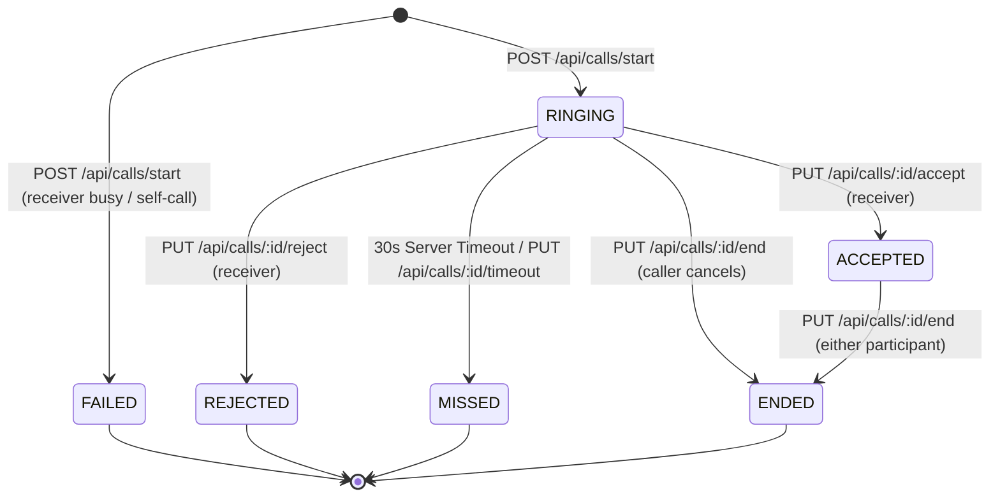

# Phase 23 — Real-Time Video Calling

## Overview
Phase 23 introduces native, peer-to-peer **Real-Time Video Calling** into the StreamWave platform.
The implementation uses browser-standard **WebRTC** (`RTCPeerConnection`, `MediaStream`) for high-definition 1-to-1 video and audio exchange. The Express backend and Socket.IO servers act solely as **control and signaling coordinators** (`offer`, `answer`, `ice-candidate`, `call:join`, and call state events); **no media streams pass through or proxy via Node.js**, preserving server bandwidth and scalability.

All call sessions are persistently tracked in a dedicated MySQL database table (`video_calls`), supporting strict participant-only isolation, busy state detection, ringing timeouts, graceful audio-only fallback, and end-to-end call history logging.

---

## 1. Database Architecture

### `video_calls` Table
```sql
CREATE TABLE video_calls (
  id BIGINT UNSIGNED AUTO_INCREMENT PRIMARY KEY,
  caller_id BIGINT UNSIGNED NOT NULL,
  receiver_id BIGINT UNSIGNED NOT NULL,
  status ENUM(
    'RINGING',
    'ACCEPTED',
    'REJECTED',
    'MISSED',
    'ENDED',
    'FAILED'
  ) NOT NULL DEFAULT 'RINGING',
  started_at DATETIME NULL,
  answered_at DATETIME NULL,
  ended_at DATETIME NULL,
  end_reason VARCHAR(50) NULL,
  created_at DATETIME NOT NULL DEFAULT CURRENT_TIMESTAMP,
  CONSTRAINT fk_video_calls_caller FOREIGN KEY (caller_id) REFERENCES users(id) ON DELETE CASCADE,
  CONSTRAINT fk_video_calls_receiver FOREIGN KEY (receiver_id) REFERENCES users(id) ON DELETE CASCADE,
  INDEX idx_video_calls_caller (caller_id),
  INDEX idx_video_calls_receiver (receiver_id),
  INDEX idx_video_calls_status (status),
  INDEX idx_video_calls_created (created_at)
) ENGINE=InnoDB DEFAULT CHARSET=utf8mb4 COLLATE=utf8mb4_unicode_ci;
```

---

## 2. Call State Machine & Lifecycle



### Valid State Transitions
1. `RINGING` $\rightarrow$ `ACCEPTED`: Receiver clicks Accept within 30 seconds. Sets `answered_at = NOW()`, `started_at = NOW()`.
2. `RINGING` $\rightarrow$ `REJECTED`: Receiver clicks Decline. Sets `ended_at = NOW()`, `end_reason = 'rejected'`.
3. `RINGING` $\rightarrow$ `MISSED`: Unanswered after 30-second server timer. Sets `ended_at = NOW()`, `end_reason = 'ringing_timeout'`.
4. `RINGING` $\rightarrow$ `ENDED`: Caller cancels before receiver answers. Sets `ended_at = NOW()`, `end_reason = 'caller_cancelled'`.
5. `ACCEPTED` $\rightarrow$ `ENDED`: Either participant hangs up or disconnects. Sets `ended_at = NOW()`, `end_reason = 'completed' | 'disconnected'`.
6. Terminal states (`ACCEPTED`, `REJECTED`, `MISSED`, `ENDED`, `FAILED`) cannot transition backward; invalid transitions return HTTP 400 Bad Request.

---

## 3. Signaling Protocol & Socket Rooms

### Socket.IO Rooms
- **User Room**: `user:<userId>` (reused from Phase 22). Used for targeted call signals: `call:incoming`, `call:accepted`, `call:rejected`, `call:busy`, `call:timeout`, `call:ended`.
- **Call Room**: `call:<callId>`. Strictly isolated WebRTC signaling room created when participants join the active call.

### Room Authorization
When any socket emits `call:join` with `{ callId }`, the server performs authoritative database verification:
- Checks if `socket.user.id` matches either `call.caller_id` or `call.receiver_id`.
- Non-participants are rejected with a `call:error` event and denied room entry.

### WebRTC Signaling Events
```
Caller (Socket A)              Server / Signaling               Receiver (Socket B)
       |                                |                                |
       | ----- call:join {callId} ----> |                                |
       |                                | <---- call:join {callId} ----- |
       |                                |                                |
       | ----- call:offer (SDP) ------> | ----- call:offer (SDP) ------> |
       |                                |                                |
       | <---- call:answer (SDP) ------ | <---- call:answer (SDP) ------ |
       |                                |                                |
       | <--- call:ice-candidate -----> | <--- call:ice-candidate -----> |
       |                                |                                |
       | ================= Peer-to-Peer Audio/Video (WebRTC) ========== |
```

---

## 4. REST API Endpoints

All endpoints require JWT authentication (`Authorization: Bearer <token>`).

### 1. Initiate Video Call
- **Endpoint**: `POST /api/calls` (or `POST /api/calls/start`)
- **Body**: `{ "receiverId": 123 }`
- **Rate Limit**: 200 requests/minute
- **Response** `201 Created`:
```json
{
  "success": true,
  "message": "Call initiated",
  "call": {
    "id": 1,
    "roomId": "call:1",
    "callerId": 42,
    "receiverId": 123,
    "status": "RINGING",
    "createdAt": "2026-09-18T12:00:00.000Z",
    "caller": { "id": 42, "name": "John Doe", "avatarUrl": "/uploads/..." },
    "receiver": { "id": 123, "name": "Jane Doe", "avatarUrl": null }
  }
}
```
- **Error Responses**:
  - `400 Bad Request`: Self-call (`"You cannot call yourself."`) or invalid payload.
  - `404 Not Found`: Recipient user does not exist or is inactive.
  - `409 Conflict`: Target user or caller is currently on another call (`isBusy: true`).

### 2. Accept Call
- **Endpoint**: `PUT /api/calls/:callId/accept`
- **IDOR Protection**: Only `receiver_id` can accept. Returns `403 Forbidden` if caller or third-party attempts.
- **Response** `200 OK`:
```json
{
  "success": true,
  "message": "Call accepted",
  "call": {
    "id": 1,
    "callerId": 42,
    "receiverId": 123,
    "status": "ACCEPTED",
    "answered_at": "2026-09-18T12:00:05.000Z",
    "startedAt": "2026-09-18T12:00:05.000Z"
  }
}
```

### 3. Reject Call
- **Endpoint**: `PUT /api/calls/:callId/reject`
- **IDOR Protection**: Only `receiver_id` can reject.
- **Response** `200 OK`: Status becomes `REJECTED`, `end_reason = 'rejected'`.

### 4. End Call
- **Endpoint**: `PUT /api/calls/:callId/end`
- **Body**: `{ "endReason": "completed" }`
- **IDOR Protection**: Must be either caller or receiver. Third-party gets `403 Forbidden`.
- **Response** `200 OK`: Status becomes `ENDED`, `ended_at` timestamp recorded.

### 5. Call History
- **Endpoint**: `GET /api/calls/history?page=1&limit=20`
- **Isolation**: Returns only calls where authenticated user is caller or receiver.
- **Response** `200 OK`: Includes duration in seconds, peer details, call direction (`INCOMING` / `OUTGOING`), and pagination metadata.

### 6. Call Details
- **Endpoint**: `GET /api/calls/:callId`
- **IDOR Protection**: Only participants can inspect details; third party receives `403 Forbidden`.

### 7. ICE Servers Configuration
- **Endpoint**: `GET /api/calls/ice-servers` (or `/api/calls/config/ice-servers`)
- **Response** `200 OK`: Dynamic STUN/TURN configuration.

---

## 5. Frontend Architecture & WebRTC Client

### Components & Flow
1. **`CallContext.jsx`**:
   - Manages incoming/active call state, ringtone audio, and socket listeners globally.
   - Synthesizes a telephone ringtone using the **Web Audio API** (`OscillatorNode` at 440Hz + 480Hz) with gentle volume ramping.
2. **`IncomingCallModal.jsx`**:
   - Non-blocking modal overlay rendered on all authenticated pages.
   - Shows caller's name, avatar, and ringing pulse animation with "Accept" and "Decline" buttons.
3. **`VideoCallRoom.jsx` (`/call/:callId`)**:
   - Initializes `RTCPeerConnection` with STUN/TURN servers.
   - Requests media devices (`getUserMedia`).
   - **Graceful Audio-Only Fallback**: If camera access fails (`NotFoundError`, `NotReadableError`, `OverconstrainedError`), falls back to audio-only with an informative warning banner instead of aborting the call.
   - Interactive controls: Mic Mute/Unmute, Camera On/Off, and End Call.
   - Call duration timer that increments every second once `connectionState === 'connected'`.
4. **`CallHistory.jsx` (`/call-history`)**:
   - Filterable list (`All`, `Missed`, `Completed`) with call duration, relative timestamp, and "Call Again" button.
5. **Entry Points**:
   - "Video Call" button on Channel page (`/channel/:channelId`).
   - "Video Call" button on User Profile page (`/profile/:userId`).
   - "Call History" item in main navigation sidebar.

---

## 6. Verification & Automated Test Results

The automated test suite (`scratch/test_phase23.js`) exercises all 14 mandatory requirement conditions, WebRTC signaling events, and edge cases.

### Test Execution Output
```
========================================================
PHASE 23 — REAL-TIME VIDEO CALLING TEST SUITE
========================================================

--- Setting up Phase 23 Test Users ---
Created test users: Caller (490), Receiver (491), ThirdParty (492)
  ✓ All 3 user test sockets connected and authenticated

--- Test 1: Unauthenticated Call Request (401) ---
  ✓ Expected 401 Unauthorized for unauthenticated call start, got 401

--- Test 2: Self-Call Rejected (400) ---
  ✓ Expected 400 Bad Request for self-call, got 400
  ✓ Expected 'cannot call yourself' message, got You cannot call yourself.

--- Test 3: Non-Existent Recipient (404) ---
  ✓ Expected 404 for non-existent recipient, got 404

--- Test 4: Start Call (201 RINGING) and Socket Delivery ---
  ✓ Expected 201 Created on start call, got 201
  ✓ Call response success is true
  ✓ Expected status RINGING, got RINGING
  ✓ Expected roomId 'call:37', got call:37
  ✓ Socket call:incoming event has correct callId: 37
  ✓ Socket call:incoming has caller id: 490

--- Test 5: IDOR Accept as Caller Rejected (403) ---
  ✓ Expected 403 when caller attempts to accept, got 403

--- Test 6: Accept Call as Receiver (200 ACCEPTED) ---
  ✓ Expected 200 on accept call, got 200
  ✓ Expected status ACCEPTED, got ACCEPTED
  ✓ answered_at timestamp is populated in DB
  ✓ Socket call:accepted received by caller with callId 37

--- Test 7: Busy User Handling ---
  ✓ Expected 409 or 400 for busy user, got 409
  ✓ Response contains isBusy = true
  ✓ Failed busy call was logged in video_calls
  ✓ Expected DB status FAILED, got FAILED
  ✓ Expected DB end_reason 'busy', got busy

--- Test 8: IDOR End Call by Non-Participant Rejected (403) ---
  ✓ Expected 403 when non-participant ends call, got 403

--- Test 9: End Call as Participant (200 ENDED) ---
  ✓ Expected 200 on end call, got 200
  ✓ Expected status ENDED, got ENDED
  ✓ ended_at timestamp is populated in DB
  ✓ Expected end_reason 'completed', got completed
  ✓ Socket call:ended received by receiver with callId 37

--- Test 10: Invalid State Transitions (400) ---
  ✓ Expected 400 when accepting already ended call, got 400
  ✓ Expected 400 when ending already ended call, got 400

--- Test 11: Call Reject Workflow ---
  ✓ Call 2 created in status RINGING
  ✓ Expected 200 on reject, got 200
  ✓ Expected status REJECTED, got REJECTED
  ✓ Expected end_reason 'rejected', got rejected
  ✓ Socket call:rejected received with callId 39

--- Test 12: Call History Isolation and Pagination ---
  ✓ Expected 200 for User A call history, got 200
  ✓ History response contains data array
  ✓ User A history includes both call1 and call2
  ✓ User C can fetch history
  ✓ User C history strictly isolates and excludes User A & B private calls

--- Test 13: Call Details & IDOR Prevention ---
  ✓ Expected 200 for participant fetching call details, got 200
  ✓ Call details contain caller object
  ✓ Call details contain receiver object
  ✓ Expected 403 Forbidden for non-participant fetching call details, got 403

--- Test 14: Socket Authentication & Room Authorization ---
  ✓ Socket connection with invalid token correctly rejected
  ✓ Expected socket error for unauthorized room join, got: {"callId":37,"message":"Unauthorized to join this call room."}

--- Test 15: WebRTC Signaling Relay ---
  ✓ Receiver correctly received relayed WebRTC offer
  ✓ Caller correctly received relayed WebRTC answer
  ✓ Receiver correctly received relayed ICE candidate

--- Test 16: Ringing Timeout & Missed Call Handling ---
  ✓ Call 4 created in RINGING status
  ✓ Expected status MISSED after ringing timeout, got MISSED
  ✓ Expected end_reason 'ringing_timeout', got ringing_timeout
  ✓ Socket call:timeout received with callId 41

--- Test 17: ICE Servers Endpoint ---
  ✓ Expected 200 for ICE servers config, got 200
  ✓ Response contains iceServers array
  ✓ At least one STUN/TURN server returned
  ✓ Default STUN server is configured

========================================================
ALL PHASE 23 TESTS PASSED (56 assertions)
========================================================
```

### Full Regression Test Summary
- **Phase 16 (Razorpay Payments & Ledgers)**: 60/60 passed
- **Phase 17 (Subscription Dashboard & Usage)**: 42/42 passed
- **Phase 18 (Premium Video Access Control)**: 61/61 passed
- **Phase 19 (Controlled Video Downloads)**: 78/78 passed
- **Phase 20 (Download History & Quota Tracking)**: 57/57 passed
- **Phase 21 (Playlists & Watch Later)**: 54/54 passed
- **Phase 22 (Real-Time Notifications)**: 48/48 passed
- **Phase 23 (Real-Time Video Calling)**: 56/56 passed
- **Frontend Production Build (`vite build`)**: 0 errors, 1771 modules transformed
