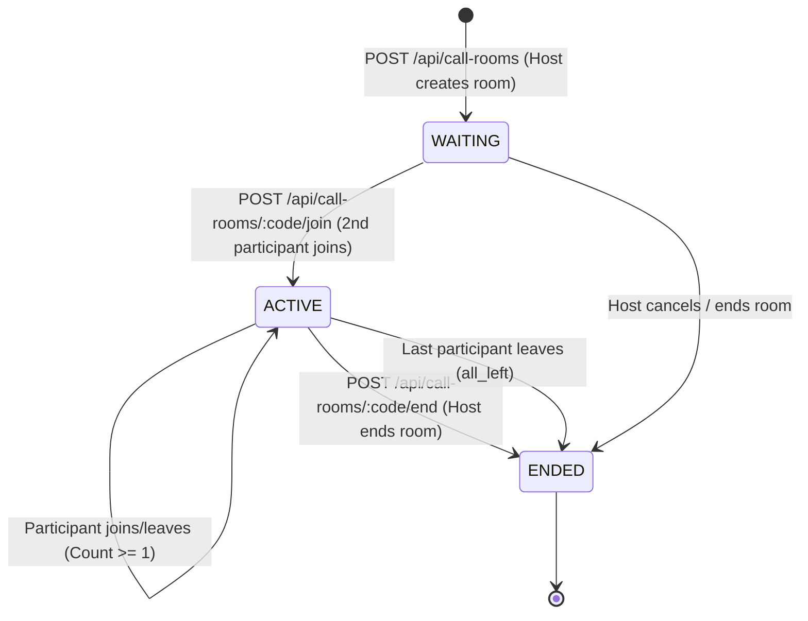
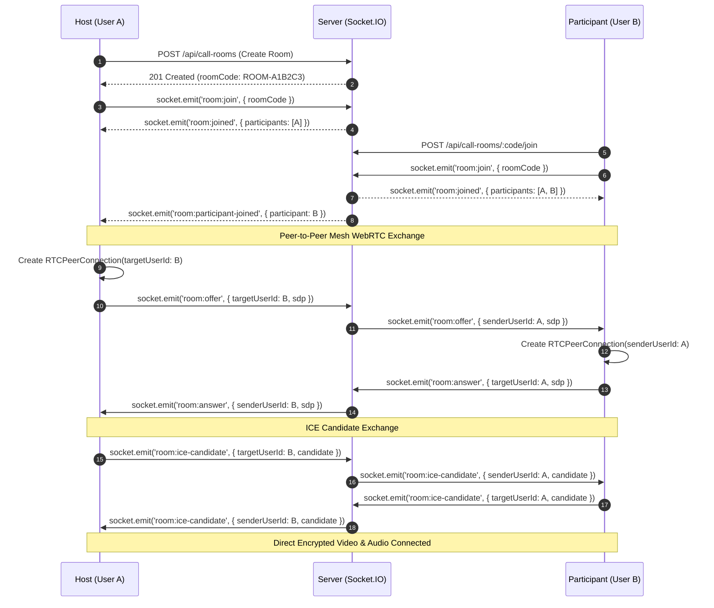

# Phase 24 — Group / One-to-One Video Call Rooms

## Overview
Phase 24 extends StreamWave's real-time communication platform to support multi-user group conference rooms and dedicated one-to-one video rooms. 

Built upon a pure **peer-to-peer (P2P) WebRTC mesh topology**, every participant establishes direct `RTCPeerConnection` tunnels with every other active participant in the room (scaling up to 6 participants per room). A single reusable local media stream (`MediaStream`) is attached across all peer connections, maximizing client efficiency and preserving video/audio synchronization.

The Node.js/Express backend and Socket.IO servers act strictly as **control, persistence, and signaling coordinators**; **no video or audio streams are proxied through Node.js or stored in MySQL**.

All rooms and participant states are persistently managed in MySQL (`call_rooms` and `call_room_participants`), featuring atomic capacity enforcement, automatic host transfer, room cleanup, real-time invitations, and notification system integration.

---

## 1. Database Architecture

### `call_rooms` Table
Stores room metadata, lifecycle states, creator information, and participant limits.
```sql
CREATE TABLE IF NOT EXISTS call_rooms (
  id BIGINT UNSIGNED AUTO_INCREMENT PRIMARY KEY,
  room_code VARCHAR(64) NOT NULL UNIQUE,
  created_by BIGINT UNSIGNED NOT NULL,
  room_type ENUM('ONE_TO_ONE', 'GROUP') NOT NULL DEFAULT 'ONE_TO_ONE',
  status ENUM('WAITING', 'ACTIVE', 'ENDED') NOT NULL DEFAULT 'WAITING',
  max_participants INT NOT NULL DEFAULT 6,
  created_at DATETIME NOT NULL DEFAULT CURRENT_TIMESTAMP,
  started_at DATETIME NULL,
  ended_at DATETIME NULL,
  CONSTRAINT fk_call_rooms_creator
    FOREIGN KEY (created_by)
    REFERENCES users(id)
    ON DELETE CASCADE,
  INDEX idx_call_rooms_creator (created_by, created_at),
  INDEX idx_call_rooms_status (status)
) ENGINE=InnoDB DEFAULT CHARSET=utf8mb4 COLLATE=utf8mb4_unicode_ci;
```

### `call_room_participants` Table
Tracks individual participant session states, roles, and join/leave timestamps.
```sql
CREATE TABLE IF NOT EXISTS call_room_participants (
  id BIGINT UNSIGNED AUTO_INCREMENT PRIMARY KEY,
  room_id BIGINT UNSIGNED NOT NULL,
  user_id BIGINT UNSIGNED NOT NULL,
  role ENUM('HOST', 'PARTICIPANT') NOT NULL DEFAULT 'PARTICIPANT',
  status ENUM('INVITED', 'JOINED', 'LEFT', 'REMOVED') NOT NULL DEFAULT 'INVITED',
  joined_at DATETIME NULL,
  left_at DATETIME NULL,
  created_at DATETIME NOT NULL DEFAULT CURRENT_TIMESTAMP,
  CONSTRAINT fk_room_participants_room
    FOREIGN KEY (room_id)
    REFERENCES call_rooms(id)
    ON DELETE CASCADE,
  CONSTRAINT fk_room_participants_user
    FOREIGN KEY (user_id)
    REFERENCES users(id)
    ON DELETE CASCADE,
  UNIQUE KEY unique_room_user (room_id, user_id),
  INDEX idx_room_participants_room (room_id),
  INDEX idx_room_participants_user (user_id)
) ENGINE=InnoDB DEFAULT CHARSET=utf8mb4 COLLATE=utf8mb4_unicode_ci;
```

### Notifications ENUM Extension
The `notifications.type` ENUM is updated to include `'CALL_ROOM_INVITATION'` for in-app delivery.

---

## 2. Room State Machine & Lifecycle



### State Transitions:
1. **Creation (`WAITING`)**: Room is initialized with a cryptographically secure, non-sequential code (`ROOM-XXXXXX`). Creator is automatically assigned role `HOST` with status `JOINED`.
2. **Activation (`ACTIVE`)**: Transitions from `WAITING` to `ACTIVE` when the 2nd active participant joins. `started_at` is stamped.
3. **Atomic Capacity Check**: If `COUNT(status = 'JOINED') >= max_participants`, new join attempts are rejected with `HTTP 409 Conflict` (`"This room is full."`).
4. **Host Transference**: If the `HOST` leaves while other participants remain, the oldest active participant (`ORDER BY joined_at ASC LIMIT 1`) is automatically promoted to `HOST`, and `room:host-changed` is emitted.
5. **Termination (`ENDED`)**:
   - Host clicks **End Room for Everyone**: room is marked `ENDED`, all participants updated to `LEFT`, and `room:ended` is broadcast.
   - Last participant leaves: room status automatically updates to `ENDED`.

---

## 3. WebRTC Full-Mesh Signaling Architecture



### Targeted Signaling Isolation:
In group calling, WebRTC SDP offers, answers, and ICE candidates must NOT be broadcast to the entire room. Instead, signaling events carry `targetUserId` and are relayed strictly to that user's private socket room (`user:<targetUserId>`), ensuring complete isolation between mesh peers.

---

## 4. REST API Reference

| Method | Endpoint | Auth | Description |
|---|---|---|---|
| `POST` | `/api/call-rooms` | Required | Create room (`roomType: 'GROUP' \| 'ONE_TO_ONE'`, `maxParticipants`) |
| `GET` | `/api/call-rooms/:roomCode` | Optional/Auth | Fetch room metadata, status, participant count |
| `POST` | `/api/call-rooms/:roomCode/join` | Required | Join room (capacity-checked, atomic) |
| `POST` | `/api/call-rooms/:roomCode/leave` | Required | Leave room (triggers host transfer if host leaves) |
| `POST` | `/api/call-rooms/:roomCode/end` | Host Only | End room for all participants |
| `GET` | `/api/call-rooms/:roomCode/participants` | Member Only | Fetch active participants list |
| `POST` | `/api/call-rooms/:roomCode/invite` | Host Only | Send real-time invitation and notification |

---

## 5. Socket.IO Events Reference

| Event Name | Direction | Payload | Description |
|---|---|---|---|
| `room:join` | Client $\rightarrow$ Server | `{ roomCode }` | Join socket room `room:<roomCode>` |
| `room:joined` | Server $\rightarrow$ Client | `{ roomCode, role, participants }` | Acknowledgment with active members |
| `room:participant-joined` | Server $\rightarrow$ Peers | `{ roomCode, userId, name, role }` | Broadcast when new peer joins |
| `room:participant-left` | Server $\rightarrow$ Peers | `{ roomCode, userId }` | Broadcast when peer leaves |
| `room:host-changed` | Server $\rightarrow$ Peers | `{ roomCode, newHostId }` | Broadcast when host role is transferred |
| `room:ended` | Server $\rightarrow$ Peers | `{ roomCode, endedBy, reason }` | Broadcast when room terminates |
| `room:audio-state` | Bidirectional | `{ roomCode, userId, enabled }` | Audio mute state sync |
| `room:video-state` | Bidirectional | `{ roomCode, userId, enabled }` | Video mute state sync |
| `room:offer` | Bidirectional | `{ roomCode, targetUserId, sdp }` | Targeted WebRTC offer |
| `room:answer` | Bidirectional | `{ roomCode, targetUserId, sdp }` | Targeted WebRTC answer |
| `room:ice-candidate` | Bidirectional | `{ roomCode, targetUserId, candidate }` | Targeted ICE candidate |
| `room:invitation` | Server $\rightarrow$ Invitee | `{ roomCode, roomType, host }` | Real-time call invitation alert |

---

## 6. Frontend Architecture

- **`CallRoomPage` (`/call-room/:roomCode`)**:
  - **Pre-call Lobby**: Displays local camera preview, microphone check, room title, and "Join Room" button.
  - **In-Call Dynamic Grid (`ParticipantGrid`)**: Responsive CSS grid adapting layout according to active participant count (1 tile: full screen, 2 tiles: side-by-side, 3-4 tiles: 2x2, 5-6 tiles: 3x2).
  - **Participant Tile (`ParticipantTile`)**: Shows video stream with fallback avatar, active speaking ring indicator, mute badges, connection status, and host badge.
  - **Call Controls**: Mute/unmute microphone, enable/disable camera, toggle participant drawer, invite users, leave room, or end room (host only).
  - **Participant Drawer (`ParticipantDrawer`)**: Slide-out panel listing connected participants with roles, join times, and media states.
  - **Invite Modal (`InviteModal`)**: Shareable direct link copy button and user ID invite dispatcher.
- **Entry Points**:
  - Direct "Video Room" quick action button in top navigation bar (`Navbar.jsx`).
  - "Create Video Room" option in user profile dropdown menu.
  - "New Video Room" button on Call History page (`CallHistory.jsx`).
  - Clicking on a `CALL_ROOM_INVITATION` in the Notifications center (`/notifications`).

---

## 7. Automated Test Suite & Verification

The test suite (`scratch/test_phase24.js`) validates all functional, security, and signaling requirements:
- **Test 1**: Room Creation REST API (Auth check, validation, unique code generation, auto-host assignment).
- **Test 2**: Room Details & IDOR Participant Authorization (403 for non-members).
- **Test 3**: User Joining Room & State Transitions (`WAITING` $\rightarrow$ `ACTIVE`).
- **Test 4**: Capacity Enforcement (HTTP 409 Conflict when room limit reached).
- **Test 5**: Room Invitations & Persistent Notifications (`CALL_ROOM_INVITATION`).
- **Test 6**: Room Leaving, Automatic Host Transference, and Room Termination.
- **Test 7**: Socket.IO Room Signaling (`room:join`, `room:joined`, member broadcasts, audio/video state sync).
- **Test 8**: Targeted Mesh WebRTC Signaling (`room:offer`, `room:answer`, `room:ice-candidate` routed by `targetUserId`, peer isolation verified).
- **Test 9**: Host Room Ending & Socket Eviction.
- **Test 10**: Phase 23 1-to-1 Calling Compatibility Check.

**Result**: 55 passed assertions, 0 failures. Full regression tests for Phases 20, 21, 22, and 23 passed 100%.
