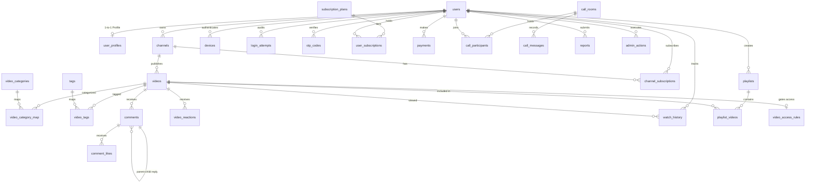

# Video Platform Architecture Specification

This document details the software architecture, design principles, and directory conventions for the full-stack, real-time video platform.

---

## 1. High-Level System Overview

The system is architected as a modular monorepo containing three core tiers:
- **Frontend Tier (`frontend/`)**: High-performance Single Page Application (SPA) powered by React 18, Vite, React Router, Tailwind CSS, Lucide React, and a theme context supporting dark and light modes.
- **Backend API Tier (`backend/`)**: Node.js & Express REST application utilizing Helmet, CORS, Morgan, rate limiting, and centralized error handling with structured JSON responses.
- **Data & Documentation Tier (`database/`, `docs/`)**: Schema specifications, architectural diagrams, and migration scripts.

```
                  +-----------------------------------+
                  |        Client Application         |
                  |     (React 18 + Vite + Tailwind)  |
                  +-----------------+-----------------+
                                    |
                            HTTP/REST (Axios)
                                    |
                  +-----------------v-----------------+
                  |       Backend Express Server      |
                  |  (Security: Helmet, CORS, Limiter)|
                  +-----------------+-----------------+
                                    |
                       Modular Router & Controllers
                                    |
             +----------------------+----------------------+
             |                      |                      |
      +------v------+        +------v------+        +------v------+
      | Auth/Users  |        | Content/Meta|        | Interactions|
      |   Routes    |        | (Videos/Ch) |        | (Likes/Comms|
      +-------------+        +-------------+        +-------------+
```

---

## 2. Directory Structure

```text
youtube-realtime-platform/
│
├── frontend/
│   ├── src/
│   │   ├── assets/              # Logos, brand badges, and SVGs
│   │   ├── components/          # Reusable UI primitives and layout navigation
│   │   │   ├── common/          # Button, Modal, Loading, ErrorMessage, EmptyState, Card
│   │   │   └── navigation/      # Navbar, Sidebar, BottomNav
│   │   ├── context/             # ThemeContext (Dark/Light mode)
│   │   ├── hooks/               # Custom hooks for responsiveness and data fetching
│   │   ├── layouts/             # MainLayout with responsive side drawer and mobile bar
│   │   ├── pages/               # 13 Routing views with responsive layouts
│   │   ├── services/            # Centralized Axios client (api.js)
│   │   ├── utils/               # Formatting, date helpers, and constants
│   │   ├── App.jsx              # React Router registry
│   │   ├── index.css            # Tailwind directives and CSS variables
│   │   └── main.jsx             # React DOM entry point
│   ├── public/                  # Public web assets and favicon
│   ├── package.json             # Frontend dependencies and build scripts
│   ├── vite.config.js           # Vite dev server configuration
│   └── .env.example             # Frontend environment variables
│
├── backend/
│   ├── config/                  # Configuration loaders (database, ports, env)
│   ├── controllers/             # Individual route controller handlers
│   ├── middleware/              # Error handler, 404 handler, rate limiter
│   ├── models/                  # Database data models (Phase 2+)
│   ├── routes/                  # 11 Modular REST API routes
│   ├── services/                # Business logic services (Phase 2+)
│   ├── utils/                   # Helpers and custom error classes
│   ├── uploads/                 # Storage for media files (.gitkeep)
│   ├── server.js                # Express app entry point
│   ├── package.json             # Backend dependencies and scripts
│   └── .env.example             # Backend environment variables
│
├── database/
│   └── README.md                # 26-table schema specification for Phase 2
│
├── docs/
│   └── architecture.md          # Architecture and design specification
│
├── .gitignore
├── README.md
└── package.json                 # Monorepo orchestration scripts
```

---

## 3. Frontend Architecture

### Theme System (Dark / Light)
The frontend utilizes a custom `ThemeContext` providing:
- Persistent theme state stored in `localStorage`
- Class-based toggling on `document.documentElement` (`dark` class)
- High-contrast accessible color palette utilizing CSS variables and Tailwind utility classes

### Component Hierarchy
- **Common Primitives (`components/common/`)**:
  - `Button`: Multiple variants (`primary`, `secondary`, `outline`, `ghost`, `danger`), icon support, and accessible loading states.
  - `Modal`: Accessible backdrop dialog with keyboard ESC dismissing and focus management.
  - `Loading`: Dual mode — animated spinner and skeleton pulses.
  - `ErrorMessage`: Error state banner with retry button callback.
  - `EmptyState`: Clean empty views for playlists, search, subscriptions, etc.
  - `Card`: Surface container with elevation and hover animations.
- **Navigation (`components/navigation/`)**:
  - `Navbar`: Sticky global header with brand mark, search input, theme toggle, notifications, and user avatar.
  - `Sidebar`: Desktop and tablet navigation drawer with active route highlighting.
  - `BottomNav`: Mobile-first bottom bar for quick navigation on mobile screens.

---

## 4. Backend Architecture

### Security Layers
1. **Helmet**: Secures HTTP headers against MIME sniffing, clickjacking, and XSS attacks.
2. **CORS**: Configured specifically for client origin (`http://localhost:5173`) with credentials enabled.
3. **Rate Limiting**: Defends API endpoints against brute force and DDoS using `express-rate-limit` (100 requests per 15 minutes per IP window).
4. **Body Size Limits**: JSON and URL-encoded body limits capped at 10MB to prevent payload exhaustion.
5. **Centralized Error Handling**: Unhandled exceptions and route errors are formatted into standard JSON:
   ```json
   {
     "success": false,
     "message": "Error description"
   }
   ```

---

## 5. Database Architecture (MySQL 8+)

### Design Standards & Conventions
- **Database Engine**: `InnoDB` across all 31 tables to support ACID transactions, row-level locking, and foreign key constraints.
- **Character Set & Collation**: `utf8mb4` with `utf8mb4_unicode_ci` for international character sets and emoji support.
- **Primary Keys**: `BIGINT UNSIGNED AUTO_INCREMENT` for high-volume entities; composite primary keys for associative join tables (`playlist_videos`, `video_category_map`, `video_tags`).
- **Timestamps**: All tables track `created_at TIMESTAMP DEFAULT CURRENT_TIMESTAMP` and `updated_at TIMESTAMP DEFAULT CURRENT_TIMESTAMP ON UPDATE CURRENT_TIMESTAMP`.
- **Soft Deletion & Status Enums**: Critical entities (`users`, `videos`, `comments`, `reports`) employ enumerated status fields (`ACTIVE`, `SUSPENDED`, `DELETED`, `PROCESSING`, `READY`, etc.) rather than immediate physical purge.

### Entity Domain Classification (31 Tables)



#### 1. Identity, Authentication & Security
- `users`: Core account identity, unique email/username, role (`USER`, `ADMIN`), account status (`ACTIVE`, `SUSPENDED`, `DELETED`), email verification timestamp, and last login tracking.
- `user_profiles`: 1-to-1 profile extension with `ON DELETE CASCADE`. Stores display name, biography, avatar URL, banner URL, location, and website URL.
- `devices`: Trusted devices, browser fingerprints, client IP, platform, and refresh token hash with last active timestamp.
- `login_attempts`: Rate-limiting and brute-force audit log with IP, email, user-agent, success flag, and failure reason.
- `otp_codes`: Temporary numeric MFA/verification codes (purpose: `REGISTRATION`, `LOGIN`, `PASSWORD_RESET`, `EMAIL_VERIFICATION`) with expiration and consumption tracking.

#### 2. Channels & Content Management
- `channels`: Creator channel entities with unique handle, name, description, avatar, banner, verification status, and counters (`subscriber_count`, `video_count`, `total_views`).
- `video_categories`: Standard system category taxonomy with unique slug and display order.
- `videos`: Master video entity containing video URL, thumbnail URL, duration (seconds), resolution, mime type, file size, visibility (`PUBLIC`, `UNLISTED`, `PRIVATE`), status (`PROCESSING`, `READY`, `FAILED`, `DELETED`), and counters (`view_count`, `like_count`, `dislike_count`, `comment_count`).
- `video_category_map`: Associative table with composite PK `(video_id, category_id)` linking videos to categories.
- `tags`: Tag repository with unique slug.
- `video_tags`: Associative table with composite PK `(video_id, tag_id)`.

#### 3. Engagement & Community
- `comments`: Hierarchical threaded comments with self-referencing `parent_comment_id` foreign key (`ON DELETE CASCADE`). Tracks content, pinned status, reply count, like count, and moderation status (`VISIBLE`, `HIDDEN`, `DELETED`, `REPORTED`).
- `comment_likes`: Comment reactions with composite unique index `(comment_id, user_id)`.
- `video_reactions`: Video reactions (`LIKE`, `DISLIKE`) with composite unique index `(video_id, user_id)`.
- `channel_subscriptions`: Subscriptions mapping with composite unique index `(subscriber_id, channel_id)` and notification level (`ALL`, `PERSONALIZED`, `NONE`).
- `reports`: Community reporting system supporting target types (`VIDEO`, `COMMENT`, `USER`, `CHANNEL`) with lifecycle status (`PENDING`, `REVIEWED`, `DISMISSED`, `ACTIONED`).

#### 4. Monetization & Subscriptions
- `subscription_plans`: Subscription tiers (`FREE`, `BRONZE`, `SILVER`, `GOLD`) with monthly/yearly pricing, currency, maximum resolution, download permissions, and JSON perks.
- `user_subscriptions`: Active and historical user subscriptions with plan reference, start/end dates, auto-renewal flag, and status (`ACTIVE`, `CANCELLED`, `EXPIRED`, `PENDING`).
- `payments`: Razorpay transaction audit trail with order ID, payment ID, signature, amount, currency, and status (`PENDING`, `COMPLETED`, `FAILED`, `REFUNDED`).
- `video_access_rules`: Access control table mapping premium videos to minimum required subscription plans or pay-per-view access.

#### 5. Playback & Playlists
- `watch_history`: Playback state tracking per user and video with unique `(user_id, video_id)`, storing playback position in seconds, total watch duration, and completion flag.
- `playlists`: User-curated playlists with title, description, thumbnail URL, and visibility (`PUBLIC`, `UNLISTED`, `PRIVATE`).
- `playlist_videos`: Ordered associative table with composite PK `(playlist_id, video_id)` and integer `position`.
- `watch_later`: Dedicated user watch later queue with unique `(user_id, video_id)`.
- `downloads`: Download authorization records with signed URLs and expiration.
- `download_history`: User download logs for enforcing tier quotas and device restrictions.

#### 6. Notifications & Real-Time Rooms
- `notifications`: Multi-channel in-app notification events with type (`VIDEO_UPLOAD`, `COMMENT_REPLY`, `SUBSCRIPTION`, `CALL_INVITE`, `SYSTEM`), JSON metadata, and read status.
- `call_rooms`: WebRTC video calling rooms (`ONE_TO_ONE`, `GROUP`) with custom room codes, maximum participants, host user, and room status (`WAITING`, `ACTIVE`, `ENDED`).
- `call_participants`: Conference session participants with join/leave timestamps, peer IDs, and roles (`HOST`, `CO_HOST`, `PARTICIPANT`).
- `call_messages`: Real-time in-call text messages and shared file attachment links.

#### 7. Moderation & Auditing
- `admin_actions`: Administrative security audit log tracking target type, action type (`BAN_USER`, `DELETE_VIDEO`, `SUSPEND_CHANNEL`, `DISMISS_REPORT`), reason, and admin user reference.

### Foreign Key & Cascading Strategies
- **Cascading Deletions (`ON DELETE CASCADE`)**:
  - `user_profiles` -> `users`
  - `devices`, `login_attempts`, `otp_codes` -> `users`
  - `video_category_map`, `video_tags` -> `videos`
  - `comment_likes` -> `comments`, `video_reactions` -> `videos`
  - `playlist_videos` -> `playlists`
  - `comments` -> `comments` (self-referential parent comment cascade)
  - `call_participants`, `call_messages` -> `call_rooms`
- **Soft / Nullifying Relationships (`ON DELETE SET NULL` / `RESTRICT`)**:
  - `videos.channel_id`: `RESTRICT` prevents accidental deletion of channels with published media.
  - `comments.user_id`: `SET NULL` preserves comment threads when an account is deleted, displaying anonymous user state.
  - `reports.reviewed_by`: `SET NULL` preserves report audit logs even if the reviewing admin account is altered.

### Indexing Rationale & Performance
- **Primary Indexes**: Auto-incrementing B-Tree indexes on every primary key.
- **Lookup Indexes**:
  - `users(email)`, `users(username)` (Unique B-Tree)
  - `channels(handle)` (Unique B-Tree)
  - `videos(channel_id)`, `videos(visibility, status, published_at)` (Multi-column index for feed and channel queries)
  - `comments(video_id, parent_comment_id, created_at)` (Optimized for threaded comment pagination)
  - `watch_history(user_id, updated_at)` (Optimized for user history retrieval)
  - `notifications(user_id, is_read, created_at)` (Optimized for unread badge count and notification feeds)

### Connection Pool Architecture
The backend communicates with MySQL via a resilient `mysql2/promise` connection pool:
- **Pool Size**: Configured to 10 concurrent connections (`connectionLimit: 10`), avoiding connection exhaustion on traffic spikes.
- **Async/Await Interface**: Non-blocking queries using standard JavaScript promises.
- **Resilient Startup**: Server startup invokes `testDbConnection()` inside a non-blocking `try/catch` block. If the database is initializing or temporarily unreachable, the Express server logs an informative error without terminating the application process.
- **Live Health Diagnostics**: `GET /api/health/db` runs a lightweight `SELECT 1` ping query, returning `{ success: true, message: "Database connection is healthy" }` with 200 OK or `{ success: false, message: "Database connection failed" }` with 503 Service Unavailable, completely decoupling database availability from backend process uptime.

---

## 6. Authentication & Authorization Architecture (Phase 3)

### Overview
Phase 3 implements a complete, stateless, token-based authentication system backed by MySQL and secured via HTTP-only cookies.

```
Client (React SPA)                          Backend (Express + MySQL)
       |                                                |
       |--- POST /api/auth/register ------------------->|
       |    { username, email, password, display_name } | (Validate, bcrypt hash, DB transaction)
       |<-- 201 Created (Sanitized user object) --------|
       |                                                |
       |--- POST /api/auth/login ---------------------->|
       |    { email, password }                         | (Verify bcrypt hash, log login_attempts,
       |                                                |  sign JWT with role & id)
       |<-- 200 OK + Set-Cookie (HttpOnly JWT) ---------|
       |                                                |
       |--- GET /api/auth/me (Cookie automatically sent)|
       |----------------------------------------------->| (authMiddleware verifies JWT & status)
       |<-- 200 OK { user profile data } ---------------|
       |                                                |
       |--- POST /api/auth/logout --------------------->|
       |<-- 200 OK (Cookie cleared) --------------------|
```

### Security Principles & Mechanisms
1. **Password Hashing**:
   - Implemented via `bcryptjs` with a cost factor of 12 salt rounds.
   - Plaintext passwords and hashes are strictly excluded from logs, API responses, and JWT payloads.
2. **Token Storage**:
   - Signed JSON Web Tokens (JWT) are stored in secure HTTP-only cookies (`video_platform_token`).
   - Cookie settings: `httpOnly: true`, `secure: isProduction`, `sameSite: isProduction ? 'none' : 'lax'`, `maxAge: 7 days`.
   - Prevents XSS token exfiltration since client-side JavaScript cannot access the cookie.
3. **Database Consistency**:
   - User creation uses explicit transactions (`START TRANSACTION` ... `COMMIT` / `ROLLBACK`) ensuring both `users` and `user_profiles` records are created together atomically.
4. **Audit Logging**:
   - Every login attempt is audited in `login_attempts` (`user_id`, `email`, `ip_address`, `user_agent`, `success`, `attempted_at`).
   - Generic error messages ("Invalid email or password") prevent user enumeration attacks.
5. **Route Protection**:
   - Backend `authMiddleware`: validates JWT, verifies user exists in MySQL and `status === 'ACTIVE'`, and binds `req.user`.
   - Backend `adminMiddleware`: verifies `req.user.role === 'ADMIN'`, returning HTTP 403 if unauthorized.
   - Frontend `ProtectedRoute`: redirects unauthenticated users to `/login` with return destination tracking, and blocks non-admins from `/admin` with a clean Access Denied UI.
6. **Admin Testing**:
   - No hardcoded admin passwords exist in code or seed files.
   - To elevate any registered user to admin for testing in local MySQL:
     ```sql
     UPDATE users SET role = 'ADMIN' WHERE username = '<username>';
     ```

---

## 7. User Profiles & Channel System Architecture (Phase 4)

### Overview
Phase 4 implements a complete user profile and creator channel management system, integrating secure multi-directory file uploads, atomic database queries, ownership authorization, and interactive client-side views.

```
+-----------------------------------------------------------------------------------+
|                                Client Applications                                |
|  - Profile.jsx (Public Profile View)          - MyProfile.jsx (Self View)         |
|  - EditProfile.jsx (Bio & Image Uploads)      - CreateChannel.jsx (Creation Form) |
|  - Channel.jsx (Public/Owner Channel & Modal) - Navbar.jsx (Dynamic Navigation)   |
+----------------------------------------+------------------------------------------+
                                         |
                       REST API Requests (Multipart & JSON)
                                         |
+----------------------------------------v------------------------------------------+
|                              Express API Gateway                                  |
|  - uploadMiddleware.js: Multer engine, 5MB limit, JPEG/PNG/WebP, random filenames |
|  - Static media serving: /uploads with Helmet CORP { policy: 'cross-origin' }     |
|  - authMiddleware.js: Session verification & req.user binding                     |
+--------------------+-------------------------------------+------------------------+
                     |                                     |
+--------------------v--------------------+   +------------v-----------------------+
|          User Profile Controller        |   |          Channel Controller        |
| - GET  /api/users/me                    |   | - POST /api/channels               |
| - PUT  /api/users/me                    |   | - GET  /api/channels/me            |
| - POST /api/users/me/avatar             |   | - POST /api/channels/me/avatar     |
| - POST /api/users/me/banner             |   | - POST /api/channels/me/banner     |
| - GET  /api/users/:id                   |   | - GET  /api/channels/handle/:handle|
|                                         |   | - GET  /api/channels/:id           |
+--------------------+--------------------+   +------------+-----------------------+
                     |                                     |
                     +------------------+------------------+
                                        |
+---------------------------------------v------------------------------------------+
|                            MySQL Database Engine                                 |
|  - user_profiles: bio, display_name, location, website, avatar_url, banner_url   |
|  - channels: user_id (UNIQUE), name, handle (UNIQUE), description, counters      |
+----------------------------------------------------------------------------------+
```

### Media Upload & Storage Architecture
1. **Multer Multi-Directory Storage**:
   - Files are partitioned into distinct directories under `backend/uploads/`:
     - `backend/uploads/avatars/`
     - `backend/uploads/banners/`
     - `backend/uploads/channel-avatars/`
     - `backend/uploads/channel-banners/`
   - Directories are auto-created on startup if they do not exist.
2. **Security & Validation**:
   - **File Size Limit**: Strictly limited to 5 MB (`5 * 1024 * 1024` bytes). Oversized files return HTTP 413 Payload Too Large.
   - **MIME & Extension Whitelist**: Only `image/jpeg`, `image/png`, and `image/webp` (with `.jpg`, `.jpeg`, `.png`, `.webp` extensions) are permitted. Unmatched files return HTTP 400 Bad Request.
   - **Cryptographic Naming**: Filenames use `crypto.randomBytes(16).toString('hex')` + safe extension, eliminating filename collisions and preventing directory traversal attacks.
   - **Stale Asset Cleanup**: When replacing an avatar or banner, `deleteOldUpload()` safely deletes the superseded file from the filesystem.
3. **Static File Serving & CORS Policy**:
   - Static assets are served at `/uploads` via Express static handler.
   - Helmet Cross-Origin-Resource-Policy (CORP) is configured with `{ policy: 'cross-origin' }` to allow frontend clients on separate origins/ports (e.g., `http://localhost:5173`) to load media resources without CORB or CORS blocking.

### Channel Business Logic & Integrity Guarantees
1. **One Channel Per User**:
   - Database enforces a unique constraint on `channels.user_id` (`uq_channels_user_id`).
   - The controller checks for existing channels and returns HTTP 409 Conflict if a user attempts to create a second channel.
2. **Handle Normalization**:
   - Handles are stored in lowercase alphanumeric format (with underscores and dots) without the `@` symbol (e.g., `techcreator`).
   - Queries to `GET /api/channels/handle/:handle` accept handles both with and without `@` prefix gracefully.
3. **Counter Tampering Prevention**:
   - Channel update endpoints (`PUT /api/channels/me`) strictly allow modifications only to `name` and `description`.
   - Metrics (`subscribers_count`, `videos_count`, `views_count`) cannot be modified through client-facing profile/channel endpoints.

---

## 8. Authentication Security, Device/IP Tracking & OTP System (Phase 5)

### Overview
Phase 5 elevates the authentication and session management layer to enterprise-grade security standards. It introduces cryptographically secure OTP delivery and verification, proxy-safe IP detection, granular device classification, database-backed instant session revocation, sliding-window account lockout, and an interactive security management dashboard.

```
+------------------------------------------------------------------------------------+
|                                Client Applications                                 |
|  - Security.jsx (Active Sessions, Email Verification, Password Updates, Logs)      |
|  - ForgotPassword.jsx (3-step OTP-driven password reset flow)                      |
|  - Login.jsx (Supports standard auth + step-up OTP challenge for suspicious login) |
+-----------------------------------------+------------------------------------------+
                                          |
                        HTTP Requests (JSON + Cookies)
                                          |
+-----------------------------------------v------------------------------------------+
|                              Express API Gateway                                   |
|  - trust proxy: 1 (Accurate IP behind Nginx/Cloudflare/reverse proxy)              |
|  - authLimiter & passwordResetLimiter: abuse prevention rate limiters              |
|  - authMiddleware: verifies JWT + checks devices.is_revoked in MySQL               |
+---------------------+-------------------+---------------------+--------------------+
                      |                   |                     |
+---------------------v-----+     +-------v-------------+ +-----v--------------------+
|     authController.js     |     |securityController.js| |    deviceService.js      |
| - /verify-login-otp       |     | - GET /devices      | | - Proxy-safe IP extraction|
| - /send-verification-otp  |     | - POST /logout-dev  | | - User-Agent classification|
| - /verify-email           |     | - POST /logout-all  | | - Safe IP masking        |
| - /forgot-password        |     | - GET /events       | | - Cryptographic session  |
| - /verify-reset-otp       |     +---------------------+ +--------------------------+
| - /reset-password         |                 |                     |
| - /change-password        |                 |                     |
+---------------------+-----+                 |                     |
                      |                       |                     |
+---------------------v-----------------------v---------------------v----------------+
|                         Services & Data Persistence                                |
|  - emailService.js: Multi-mode abstraction (development console / production SMTP) |
|  - otpService.js: 6-digit numeric OTP, bcrypt-hashed storage, 5-attempt limit     |
|  - securityEventService.js: Audit logging into MySQL security_events table         |
|  - MySQL Tables: users, devices, otp_codes, login_attempts, security_events        |
+------------------------------------------------------------------------------------+
```

### Core Security Principles & Implementations
1. **Cryptographic Session Management & Real-Time Revocation**:
   - Each login generates a 32-byte cryptographically secure random session ID (`crypto.randomBytes(32).toString('hex')`).
   - The session ID is bound to the device record in `devices.session_id` and signed into the JWT payload (`{ id, role, sessionId }`).
   - `authMiddleware` validates both the JWT signature and checks `devices.is_revoked = FALSE`.
   - Revoking a device, clicking "Log Out All Devices", or resetting a password immediately sets `is_revoked = TRUE, revoked_at = NOW()`, instantly denying access on subsequent requests without waiting for token expiration.
2. **One-Time Password (OTP) Engine**:
   - OTP codes are generated as 6-digit numbers (`crypto.randomInt(100000, 999999)`).
   - Plaintext OTPs are **never** stored in the database. Only bcrypt hashes are persisted in `otp_codes.otp_hash`.
   - Enforces a 10-minute expiration (`expires_at`), a 60-second resend cooldown (returning HTTP 429), and a strict 5-attempt threshold. If 5 incorrect attempts occur, the code is immediately invalidated.
   - Segregated by purpose (`REGISTRATION`, `EMAIL_VERIFICATION`, `LOGIN`, `PASSWORD_RESET`), preventing cross-purpose token abuse.
3. **Multi-Mode Email Service Abstraction**:
   - In local development (`EMAIL_MODE=development`), codes are cleanly printed to server console logs with explicit development disclaimers, enabling frictionless local testing without requiring external credentials.
   - In production, email delivery routes through SMTP credentials defined in environment variables (`SMTP_HOST`, `SMTP_PORT`, `SMTP_USER`, `SMTP_PASSWORD`).
4. **Proxy-Safe IP Detection & Privacy**:
   - Configured Express with `app.set('trust proxy', 1)`.
   - Normalizes IPv6 mapped IPv4 addresses (e.g. `::ffff:127.0.0.1` -> `127.0.0.1`).
   - IPs displayed in client security settings are masked (e.g. `192.168.***.***` or `2001:db8:****:****`) and never exposed to other users or public profiles.
5. **Account Lockout & Brute-Force Protection**:
   - 5 consecutive failed login attempts within 15 minutes triggers a temporary 15-minute account lock (`locked_until`), logging an `ACCOUNT_LOCKED` security event.
   - Successful logins reset failed attempt counters.
   - Error messages are generic ("Invalid email or password" or "If the account exists, a code has been sent"), preventing user enumeration.

---

## 5. Video Streaming & Player Architecture (Phase 9)

```text
                     Client Watch View (/watch/:videoId)
                                    |
          +-------------------------+-------------------------+
          |                                                   |
   [VideoPlayer.jsx]                                  [RelatedVideos.jsx]
 (Custom HTML5 Canvas)                                (Catalog Recommendations)
          |
   HTTP Range Requests
 (Range: bytes=start-end)
          |
          v
   +-----------------------------------------------------------+
   | Backend Video Streaming Pipeline (/api/videos/:id/stream) |
   | - Authorization & Privacy Validation                      |
   | - Storage Path Verification & Traversal Guard             |
   | - RFC 7233 Range Request Parser                           |
   | - Memory-Safe fs.createReadStream Chunking                |
   | - HTTP 206 Partial Content / 416 Range Not Satisfiable   |
   +-----------------------------------------------------------+
                               |
                               v
               Server Disk Storage (uploads/videos/)
```

### Key Architectural Principles
1. **RFC 7233 Partial Content Streaming**:
   - The streaming service inspects the client's `Range` header and responds with HTTP status `206 Partial Content`, setting `Content-Range`, `Accept-Ranges: bytes`, and the exact slice's `Content-Length`.
   - Browser clients can jump to any offset in the video timeline without needing to download the preceding byte stream.
2. **Chunked Stream Pipelining**:
   - Disk reads are performed using Node.js filesystem streams (`fs.createReadStream(filePath, { start, end }).pipe(res)`).
   - Video files are never loaded into Node.js buffer memory, guaranteeing steady server RAM consumption even with concurrent multi-gigabyte media requests.
3. **Encapsulated Control State**:
   - The custom player bypasses browser default UI entirely, implementing local state management for buffering, played progress, scrubber dragging, volume memory, fullscreen container sizing, and settings popups.
   - Keyboard navigation isolates shortcut handling to avoid collision with text inputs and forms.


