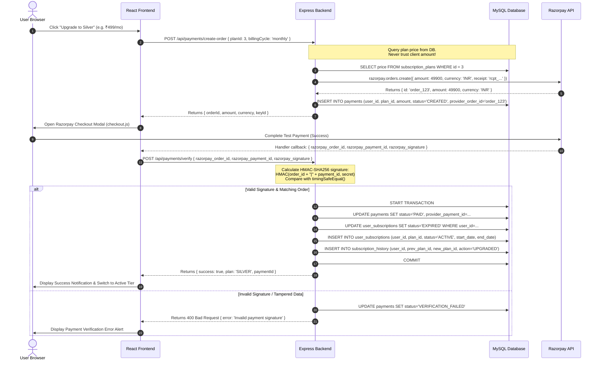

# Phase 16 — Razorpay Test Payment Integration

## 1. Overview
Phase 16 integrates official **Razorpay Test Mode** payment gateway processing into the StreamWave video platform. Users can securely upgrade from `FREE` to paid subscription tiers (`BRONZE`, `SILVER`, `GOLD`) using simulated payment methods.

### Key Tenets & Boundaries
- **Strictly Test Mode (`RAZORPAY_MODE=test`)**: No real money or live transactions are processed.
- **Zero Sensitive Data Storage**: No credit card numbers, CVVs, expiry dates, or UPI PINs are ever captured, transmitted through, or stored in application databases.
- **Authoritative Database Pricing**: All order amounts and currencies are retrieved directly from the MySQL `subscription_plans` table in paise (`₹1 = 100 paise`). Frontend-supplied prices are strictly rejected.
- **Cryptographic Signature Verification**: Every payment confirmation requires an HMAC-SHA256 signature calculated with `RAZORPAY_KEY_SECRET` using timing-safe comparison (`crypto.timingSafeEqual`).
- **Atomic State Transitions**: Order verification, payment recording, subscription activation, and history auditing are wrapped in MySQL database transactions (`START TRANSACTION` ... `COMMIT` / `ROLLBACK`).
- **Idempotent Webhooks & Payments**: Duplicate order completions, payment replays, and repeated webhooks are safely recognized and deduplicated.

---

## 2. Architecture & Payment Flow



---

## 3. Database Schema

### Updated `payments` Table (#23)
The `payments` table stores all payment attempts, order lifecycle states, cryptographic signatures, and audit metadata:

```sql
CREATE TABLE IF NOT EXISTS payments (
  id INT AUTO_INCREMENT PRIMARY KEY,
  user_id INT NOT NULL,
  plan_id INT NOT NULL,
  amount DECIMAL(10,2) NOT NULL,
  currency VARCHAR(10) DEFAULT 'INR',
  status ENUM('CREATED', 'PENDING', 'PAID', 'SUCCESS', 'FAILED', 'VERIFICATION_FAILED', 'REFUNDED', 'CANCELLED') DEFAULT 'CREATED',
  payment_method VARCHAR(50) NULL,
  provider VARCHAR(50) DEFAULT 'RAZORPAY',
  provider_order_id VARCHAR(255) NULL,
  provider_payment_id VARCHAR(255) NULL,
  provider_signature VARCHAR(255) NULL,
  receipt VARCHAR(100) NULL,
  billing_cycle ENUM('monthly', 'yearly') DEFAULT 'monthly',
  failure_reason VARCHAR(255) NULL,
  metadata JSON NULL,
  created_at DATETIME DEFAULT CURRENT_TIMESTAMP,
  updated_at DATETIME DEFAULT CURRENT_TIMESTAMP ON UPDATE CURRENT_TIMESTAMP,
  FOREIGN KEY (user_id) REFERENCES users(id) ON DELETE CASCADE,
  FOREIGN KEY (plan_id) REFERENCES subscription_plans(id) ON DELETE CASCADE,
  UNIQUE KEY uq_payments_provider_order (provider_order_id),
  UNIQUE KEY uq_payments_provider_payment (provider_payment_id),
  KEY idx_payments_user_status (user_id, status),
  KEY idx_payments_receipt (receipt)
) ENGINE=InnoDB DEFAULT CHARSET=utf8mb4 COLLATE=utf8mb4_unicode_ci;
```

---

## 4. API Endpoints

### Payment Endpoints (`/api/payments`)

| Method | Endpoint | Auth Required | Description |
| :--- | :--- | :--- | :--- |
| `POST` | `/api/payments/create-order` | Authenticated | Creates a Razorpay order for the specified `planId` and `billingCycle` ('monthly' / 'yearly'). Amount is resolved authoritative from the database. |
| `POST` | `/api/payments/verify` | Authenticated | Verifies HMAC-SHA256 signature, marks payment `PAID`, updates `user_subscriptions`, and records transition in `subscription_history`. |
| `GET` | `/api/payments/history` | Authenticated | Returns the calling user's paginated payment transaction history. |
| `POST` | `/api/payments/webhook` | None (HMAC-checked) | Receives and verifies asynchronous Razorpay webhook events (`payment.captured`, `payment.failed`, `order.paid`). Uses raw unparsed body for HMAC verification. |

### Admin Endpoints (`/api/admin/payments`)

| Method | Endpoint | Auth Required | Description |
| :--- | :--- | :--- | :--- |
| `GET` | `/api/admin/payments` | Admin Only | Lists all platform payments with filtering by `status`, `planId`, `search` (order/payment ID/receipt/username), and pagination. Includes revenue telemetry totals. |
| `GET` | `/api/admin/payments/:id` | Admin Only | Returns complete audit details for an individual transaction, including user profile and metadata. |

---

## 5. Security & Verification Rules

1. **Price Isolation**: The client never passes an `amount` field. Even if provided, the controller strictly ignores client amounts and pulls `price` or `yearly_price` from `subscription_plans` in the database.
2. **Timing-Safe HMAC Check**:
   ```javascript
   const expectedSignature = crypto
     .createHmac('sha256', secret)
     .update(`${orderId}|${paymentId}`)
     .digest('hex');

   const expectedBuf = Buffer.from(expectedSignature, 'utf8');
   const receivedBuf = Buffer.from(signature, 'utf8');

   if (expectedBuf.length !== receivedBuf.length) return false;
   return crypto.timingSafeEqual(expectedBuf, receivedBuf);
   ```
3. **Raw Body Capture for Webhooks**: Webhook signatures are computed over the unparsed HTTP request body. In `backend/server.js`, Express JSON middleware is configured with a verify handler:
   ```javascript
   app.use(express.json({
     limit: '10mb',
     verify: (req, res, buf) => {
       req.rawBody = buf;
     }
   }));
   ```
4. **User & Order Ownership Verification**: An authenticated user can only verify a payment order that belongs to their own `user_id`. Attempting to verify another user's order returns `403 Forbidden`.
5. **Idempotent Handling**: If a payment verification request is received for an already `PAID` order, the backend returns success immediately without creating duplicate subscription records or duplicate audit history.

---

## 6. Environment Configuration

The following variables must be configured in `backend/.env`:

```env
# Razorpay Configuration (TEST MODE ONLY)
RAZORPAY_MODE=test
RAZORPAY_KEY_ID=your_razorpay_test_key_id_here
RAZORPAY_KEY_SECRET=your_razorpay_test_key_secret_here
RAZORPAY_WEBHOOK_SECRET=your_razorpay_webhook_secret_here

# Subscription Configuration
SUBSCRIPTION_DEMO_MODE=false
```

> [!IMPORTANT]
> Never set `RAZORPAY_MODE=live` or use live production API keys in development or test environments.
> `RAZORPAY_KEY_SECRET` and `RAZORPAY_WEBHOOK_SECRET` must never be exposed to the client or committed into public version control.

---

## 7. Frontend Integration

1. **Dynamic Razorpay Checkout Loader**:
   `frontend/src/pages/Subscriptions.jsx` dynamically loads `https://checkout.razorpay.com/v1/checkout.js` on mount.
2. **Payment Flow Modal**:
   Clicking "Upgrade" on a paid plan calls `POST /api/payments/create-order`, launches the official `new window.Razorpay(options).open()` modal pre-filled with the user's name and email, and submits the resulting payment signature to `POST /api/payments/verify`.
3. **Downgrade / Free Tier Flow**:
   Downgrading to the `FREE` tier bypasses payment collection and invokes `POST /api/subscriptions/change` directly.
4. **Payment History Tab**:
   Users can view their past transactions, invoices/receipts, order IDs, payment IDs, and transaction statuses directly on `/subscriptions` under the "Payment History" tab.
5. **Admin Payment Ledger**:
   Platform administrators can inspect all transactions, review telemetry (total volume, successful revenue, pending/failed counts), search by ID or customer, and inspect raw transaction payloads at `/admin/payments`.

---

## 8. Test Verification

Automated integration tests (`scratch/test_phase16.js`) cover 60 test assertions:
- Rejecting unauthenticated access across order creation, verification, and payment history.
- Creation of test orders with correct paise calculations (`₹199 -> 19900 paise`).
- Rejecting client-side price tampering.
- Rejecting tampered, invalid, or forged signatures.
- Cross-user order hijacking protection (`403 Forbidden`).
- Atomic subscription upgrade, expiration of previous tier, and audit history creation.
- Verification idempotency.
- Webhook HMAC signature validation, event processing, and duplicate replay handling.
- Admin payment ledger filtering and non-admin access rejection (`403 Forbidden`).
